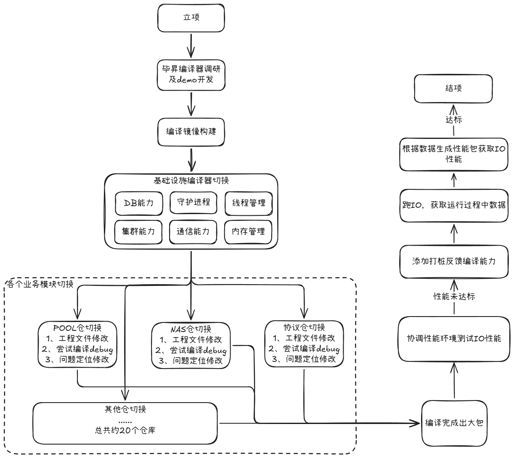
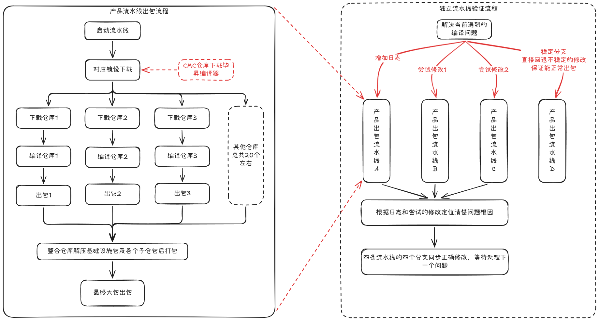
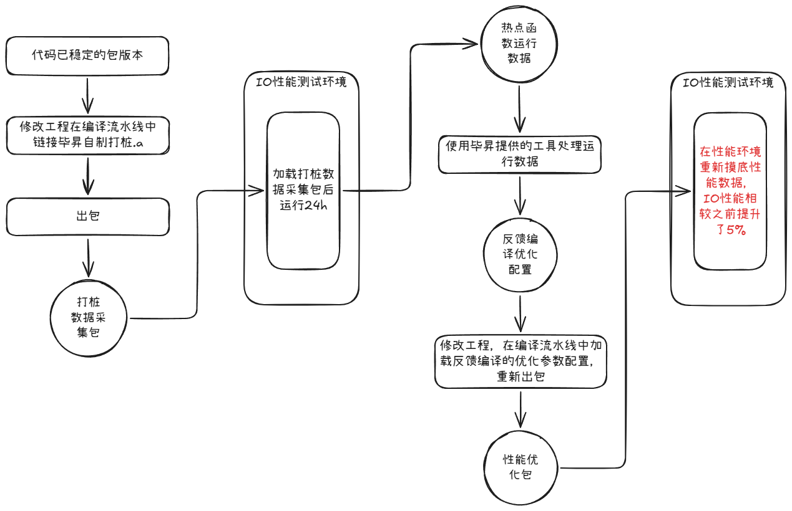

# 千万行级软件栈编译器迁移实践

## GCC → 毕昇（Clang/LLVM）Toolchain 验证项目

---

## 一、项目背景

当前存储业务全线依赖GCC编译工具链，存在商用授权风险、优化能力受限、供应链单一依赖等问题。2012实验室自研毕昇编译器基于Clang/LLVM架构，可解决GCC“一剑封喉”风险，同时具备更宽松的开源协议、更优的内存排布、循环向量化等专属优化能力，可精准提升IO密集型业务性能。

本次项目针对OceanStor集中式存储核心软件栈完成全链路编译器迁移验证，是存储产品线国产化编译栈落地的前置探索项目。

- **承载产品**：OceanStor Pacific / Dorado 6\.2\.0 集中式存储IO核心软件栈

- **软件规模**：20\+代码仓、千万行级C/C\+\+代码

- **二进制体量**：约2GB（全链路IO静态库统一打包，单进程部署架构）

- **核心项目目标**：验证毕昇编译器在大规模商用存储软件栈的落地可行性，通过专属编译优化实现整机IO性能提升10%

- **项目特性**：技术探索型攻坚项目、无专项资源支撑、技术风险高（可成可败）、跨多业务部门协同

---

## 二、核心挑战

### 1\. 构建体系碎片化，改造难度大

各业务模块编译脚本自治，GCC编译选项分散无统一规范；整体大包流水线链路极长，单次编译验证反馈周期久，传统串行调试模式效率极低，极易拖累项目周期。

### 2\. 编译器架构差异大，兼容问题密集

LLVM与GCC优化策略、语法校验、链接规则存在原生差异，业务代码重度依赖GCC扩展特性；原有代码中未暴露的未定义行为，在毕昇编译器严格优化策略下集中暴露，兼容性整改工作量大。

### 3\. 存储IO链路极度敏感，性能调优难度高

存储业务对CPU指令调度、Cache局部性、循环展开、向量化优化高度敏感，编译器替换会直接引发IO链路性能波动，单纯编译通过无法落地，必须完成性能闭环调优。

### 4\. 跨团队推进壁垒高

迁移覆盖存储全量IO链路模块，涉及多部门代码仓权限申请、构建环境适配；编译选项取舍、兼容性问题整改需要联动存储业务专家、毕昇编译器团队联合决策，协同成本极高。

---

## 三、迁移总体策略

针对千万行级大规模软件栈迁移风险高、链路复杂的特点，采用**分层递进、基建先行、先稳后优**的落地策略，规避大规模批量改造的雪崩风险：

1. **基础设施先行**：优先完成底层通信、内存管理、进程守护、日志、集群、分布式数据库等基础组件编译迁移，筑牢底层底座

2. **业务模块分批切入**：按IO链路优先级，逐一切换Index、Pool、Protocol等核心业务模块

3. **先编译通过、后稳定性验证、再性能调优**：分阶段完成编译适配、冒烟验证、PGO深度性能优化全闭环

---

## 四、CI/CD验证架构设计

### 1\. 独立隔离流水线策略

为避免迁移改造影响现网稳定构建链路，独立搭建隔离工程流水线，通过CMC编译仓动态拉取毕昇编译器包、自动化配置编译环境，无需依赖工程团队定制Docker镜像，自主打通全新编译构建链路，实现新旧编译环境完全隔离、互不干扰。

### 2\. 创新并行验证方法论（核心效率亮点）

针对流水线等待耗时过长、单分支调试效率极低的痛点，创新设计**四分支并行验证机制**，实现单人多线程并行攻坚，大幅压缩迭代周期：

- **问题定位分支**：追加详细日志，精准定位编译、链接、运行异常根因

- **尝试性修复分支**：快速验证单类问题的修复方案可行性

- **对比方案分支**：并行测试不同适配策略，筛选最优兼容方案

- **稳定基线分支**：随时保留可编译、可运行的稳定版本，用于常态化性能基线测试

---

## 五、编译选项体系化治理

针对GCC与毕昇编译器选项不兼容问题，系统性梳理全量编译参数，联合存储业务专家、2012编译器团队开展专项技术评审，建立标准化适配策略，形成可复用的迁移规范表：

|适配类型|治理策略|落地说明|
|---|---|---|
|可删除选项|直接移除|删除后不影响代码编译、运行与性能，无业务风险|
|可替换选项|Clang等效替换|使用毕昇编译器原生兼容参数替换GCC专属扩展参数|
|默认支持选项|取消显式配置|毕昇编译器默认内置能力，无需手动配置|
|暂不支持选项|需求闭环迭代|整理问题清单反馈编译器团队，推动工具能力迭代补齐|

---

## 六、典型问题案例沉淀

### 案例1：静态库链接顺序严格性差异问题

**现象**：单模块编译正常，整体大包链接报错undefined reference，编译切换后链接失败。

**根因**：LLVM链接器解析规则更严格，原有GCC宽松的静态库解析顺序不再适配，业务库存在循环依赖，导致符号解析失败。

**解决方案**：梳理库依赖拓扑，优化链接顺序；通过 `-Wl,--start-group / --end-group` 包裹循环依赖库，解决符号解析问题。

### 案例2：严格编译校验导致告警升级报错

**现象**：代码逻辑无变更，切换编译器后原有Warning升级为Error，构建中断。

**根因**：毕昇/Clang语法校验、规范校验标准高于GCC，对不规范代码、隐式转换、废弃语法拦截更严格。

**解决方案**：分级治理告警，对业务无害的冗余告警做适配关闭，对真实代码缺陷完成修复，兼顾编译稳定性与代码规范性。

---

## 七、PGO反馈编译性能优化闭环

为最大化发挥毕昇编译器性能优势，落地**PGO（Profile\-Guided Optimization）反馈导向编译优化**，形成“采样\-分析\-重编译”的性能优化闭环。

**优化链路**：代码打桩编译 → 线上IO压力采样 → 采集热点执行数据 → 生成加权优化参数 → 二次定向编译

**核心优化原理**：

- 针对**热点高频函数**：执行激进优化，包含函数内联展开、循环展开、寄存器优先分配、Cache局部性优化，大幅降低IO路径调用开销与内存访问耗时

- 针对**低频冷门函数**：轻量化优化，控制二进制体积与编译耗时，实现资源精准调度

---

## 八、项目最终成果

- ✅ 完成千万行级存储核心软件栈全链路编译器迁移，底层基建\+全业务模块编译适配落地完成

- ✅ 全量冒烟测试、基础功能测试通过，编译链路稳定可用

- ✅ 通过PGO精准优化，最终整机IO性能提升**5%**（受限于早期编译器工具成熟度，未达成10%目标，数据真实闭环上报）

- ✅ 沉淀完整编译器迁移踩坑手册、适配规范、问题解决方案

- ✅ 形成团队标准迁移方法论，支撑后续6\.2\.1版本产品化落地及其他产品线复用

---

## 九、核心方法论与组织价值沉淀

本次高难度、无资源的探索型项目，沉淀出大型商用软件栈编译器迁移的标准化工程方法论，可全团队复用：

1. **大型栈迁移必须分层落地**：基建先行、由底向上、分批迭代，规避大规模改造风险

2. **长链路流水线需并行验证**：多分支分工调试模式，极致提升攻坚效率，解决传统串行调试低效痛点

3. **编译选项治理是迁移核心**：跨团队评审、标准化归类，避免零散适配、遗留技术债务

4. **性能优化必须闭环**：依托PGO反馈编译，实现编译器精细化定向优化

5. **技术资产沉淀降本增效**：个人攻坚经验转化为组织通用能力，大幅降低后续全产品线编译栈国产化迁移成本

---

## 十、个人核心职责与贡献

本项目为无人牵头、无专项资源、高难度探索型项目，本人作为**唯一核心负责人**，全程独立主导全流程落地：

- 负责整体迁移技术方案设计、落地路径规划、项目风险把控

- 自主突破工程环境卡点，无团队支持下自研CI/CD隔离编译环境

- 创新设计多流水线并行验证机制，单人高效完成全量问题攻坚

- 牵头组织跨部门技术评审，对齐编译器团队、存储专家完成编译策略统一

- 落地PGO性能优化全链路，完成性能调优与数据闭环

- 沉淀全套可复用技术文档、宣讲材料，支撑后续版本产品化落地与跨产品线技术赋能