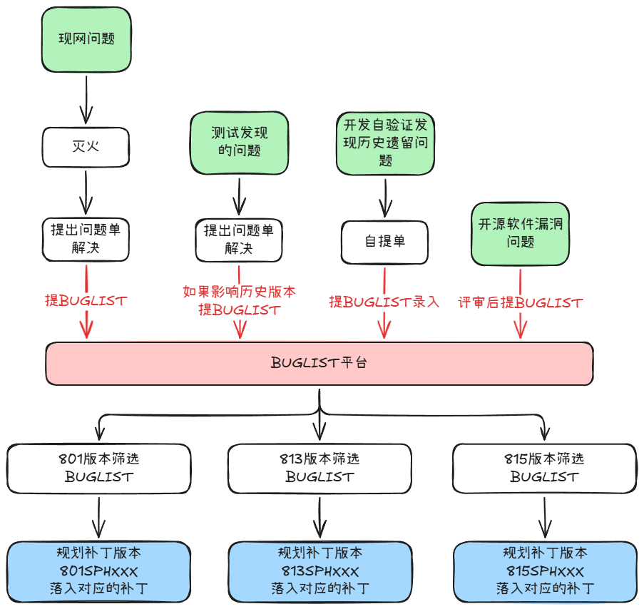
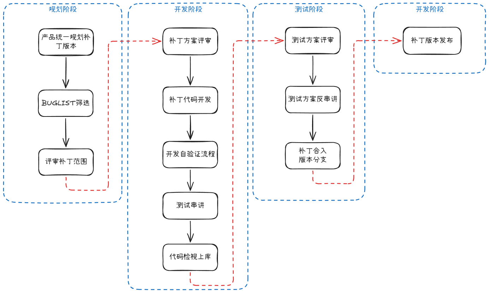
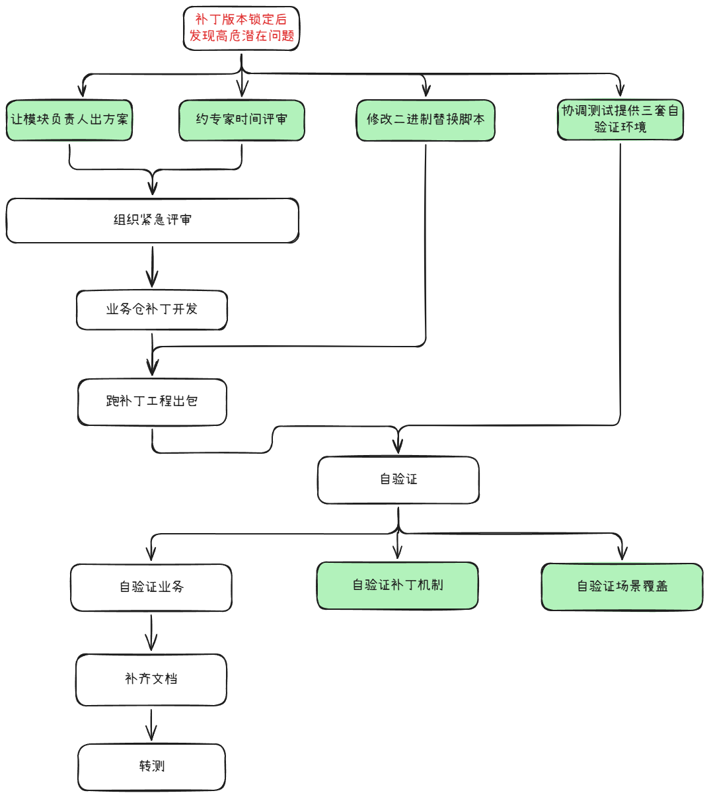

# 华为 SubPM 补丁交付实践

## 一句话定位

我在华为做了一年维护 SubPM，核心工作是把“高风险问题”稳定、可控地变成“可发布补丁”，并把交付流程从“靠人盯”升级为“靠机制跑”。

---

## 1. 场景与职责（20秒）

- 负责多个补丁版本并行交付，单版本补丁规模 1~20+
- 补丁形态主要是分布式二进制替换补丁
- 我的职责不是只催进度，而是做三件事：
  - 定范围：哪些补丁必须进版本
  - 定节奏：怎么排计划才能按时且可测
  - 守底线：确保发布链路不出事故

---

## 2. 我的关键能力与实践

### 2.1 Buglist机制下的风险治理能力

- Buglist 平台和机制是公司既有体系，我的贡献是把这套机制用好、讲清、推得动：
  - 将补丁来源统一映射到 Buglist 口径
  - 现网低概率故障回溯
  - 在研测试发现的历史遗留问题
  - 开发主动代码审视发现风险
- 推动影响范围分析和责任闭环在版本内真正执行
- 结果：补丁选择从“拍脑袋”变成“可解释、可沟通的风险优先级”

### 2.2 交付流水线标准化

- 我把补丁交付固化为 5 个 Gate：
  - 方案评审 -> 代码开发 -> 开发自验证 -> 测试串讲 -> 最终检视
- 每个补丁配一份在线文档，沉淀：背景、方案、纪要、策略、截图
- 结果：跨团队沟通成本显著下降，发布审计有据可查

### 2.3 发布工程模板化

- 针对 install.sh / uninstall.sh 做模板化
- 开发只改变量区，减少脚本质量波动
- 同时设计安装/卸载状态机，覆盖重装、跨版本替换、异常恢复
- 结果：升级回滚稳定性提升，发布失败率下降

---

## 3. 一段高价值案例

补丁版本Freeze后测出重大问题，按常规流程已来不及按时发布，此时仍需高质量快速完成。

我做法是并行推进关键路径：

- 一边组织紧急评审，快速锁定补丁方案
- 一边推进脚本与发布链路准备
- 同时拉起升级/回滚验证并收集结果

我的角色从“流程审核者”临时切换为“关键路径补位者”，在保证风险可控的前提下，把交付时间明显压缩，最终补丁按窗口发布。

这件事体现了我在高压场景下的三个能力：风险判断、资源协同、工程落地。

---

## 4. 复盘与方法论

在 SPH020 阶段，曾因测试资源不足临时拆出 SPH015，导致双向合入、重复测试、计划重排。

我的复盘结论：

- 优先采用单 Patch Train
- 在当前版本动态调整范围，而不是额外分叉版本
- 将新增需求放入下一个节奏版本

这样能显著降低分支复杂度和交付不确定性。

---

## 5. 收尾

这段经历让我完成了从“技术执行”到“交付治理”的能力升级：

- 既能下沉到脚本与验证细节
- 也能上提到版本节奏、跨团队协同和风险治理

我带来的价值不是“某一个补丁做完”，而是“让补丁版本持续、稳定、可复制地交付”。

---