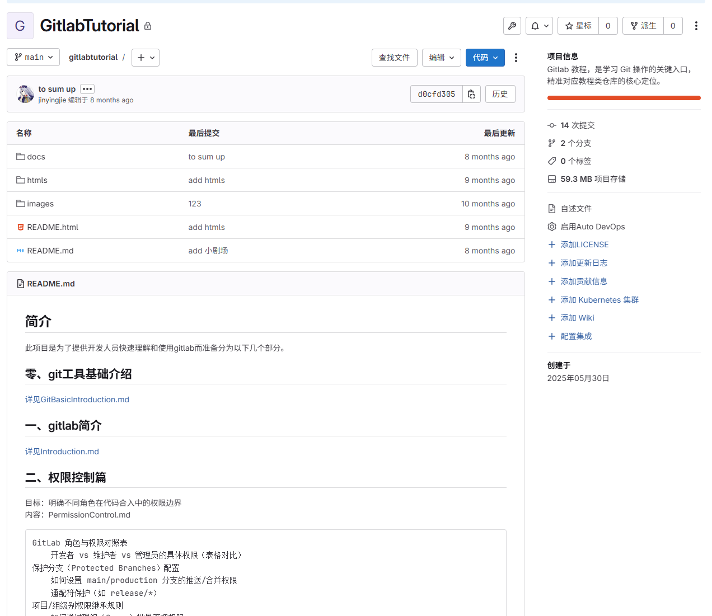
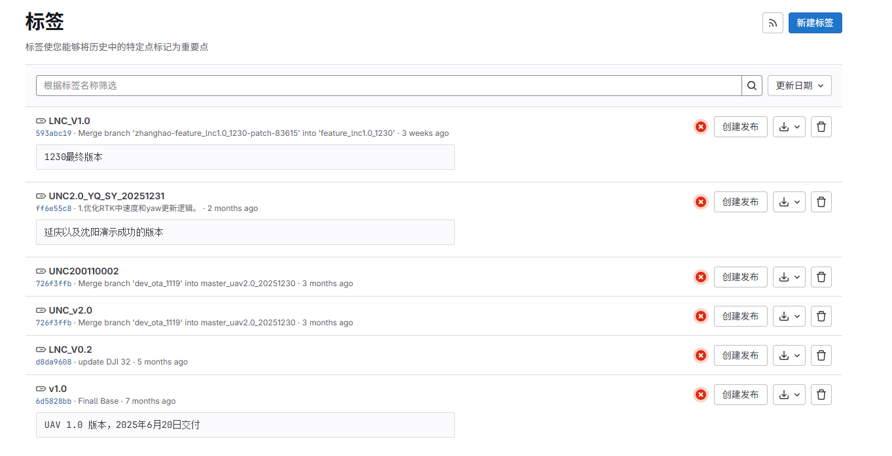
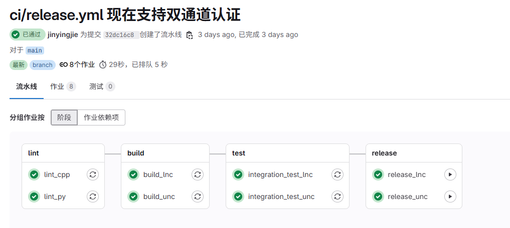
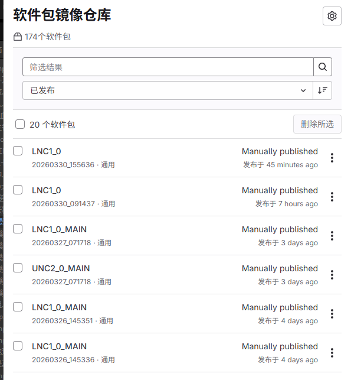

# 航天时代低空科技工程体系从0到1建设实践

## 一句话定位

这段经历里，我做的不是单点开发，而是把团队从“能写代码”逐步带到“能协作、能交付、能追溯、能度量”的工程化研发状态。

---

## 1. 背景与问题（20秒）

我刚进入团队时，研发流程还比较原始：

- 没有统一代码仓库
- 代码靠压缩包分发
- 没有版本追溯能力
- 测试取包、版本发布、任务协同都比较依赖人工

所以我后面做的事情，本质上是在补齐一套最基础的工程体系。

---

## 2. 我推进的四件关键事情

### 2.1 先把版本控制建起来

- 推动团队引入 GitLab
- 建立 tutorial 仓库
- 编写 Git 使用文档并做培训

结果是团队从个人式开发，逐步转向可协作、可追溯的研发方式。

### 2.2 再把版本基线和分支策略立起来

- 接收飞控代码后，建立统一仓库
- 创建首个 Release Tag，作为可追溯基线
- 逐步形成 feature 分支开发、演示分支隔离、Release 基线维护的轻量策略

这一步解决的是“代码能不能长期维护”的问题。

### 2.3 把质量门禁和交付流水线接进 CI

- 引入 flake8 规范检查
- 在 GitLab CI 中配置自动校验
- 增加打包 Job，并将产物上传到包仓

最终形成一条比较完整的链路：

开发提交 -> CI校验 -> 自动打包 -> 测试取包 -> OTA验证

这一步最直接的价值，是把测试取包和交付效率明显提上来了。

### 2.4 把过程管理和数据统计也补上

- 用 GitLab Issue / Label 替代线下看板
- 统一任务创建和跟踪方式
- 通过 CI 调 GitLab API，自动汇总 Issue、提交、日报数据

这一步让团队开始具备了基本的过程透明度和数据化管理能力。

---

## 3. 一个能体现体系思维的点

我当时比较看重的一点，不是只把某个工具接进来，而是把它们串成闭环。

比如版本号管理这件事，很多团队一开始都是手工维护，短期看没问题，但产品一多、分支一多，就很容易出现遗漏和不一致。

所以我后面又把版本号管理自动化接进了 CI：

- 自动更新版本登记信息
- 自动生成历史记录
- 自动创建版本变更 MR，纳入审核流程

这样版本管理就从“靠人记得改”，变成“靠流程保证正确”。

---

## 4. 这段经历最能说明我的地方

这段经历体现的不是某一项技术点，而是我有能力从 0 到 1 搭一个研发团队最基本的工程秩序：

- 先解决协作问题
- 再解决质量问题
- 再解决交付问题
- 最后补上数据和流程闭环

也就是说，我不是只会写代码，而是能把团队研发效率和交付确定性一起拉起来。

---

## 5.收尾

如果让我总结，这段经历最大的价值是：我把一个偏“作坊式”的研发环境，逐步推进到了一个具备版本管理、质量门禁、自动交付和过程追踪能力的工程化团队。

这类工作短期不一定最显眼，但对团队长期研发效率和产品可持续交付非常关键。

---
