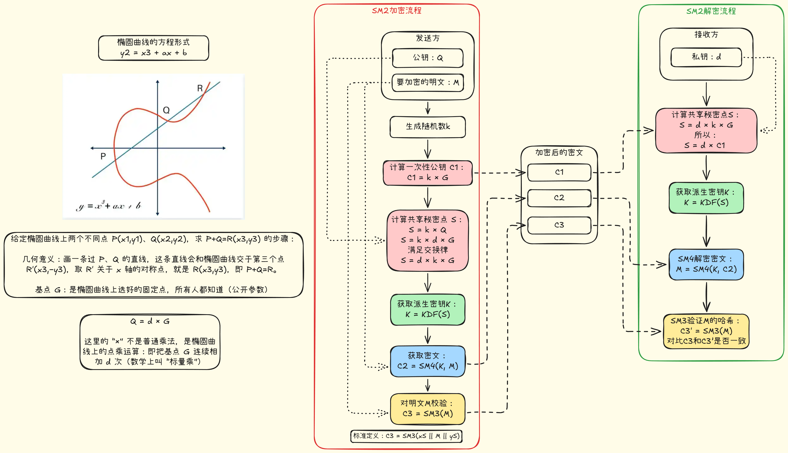
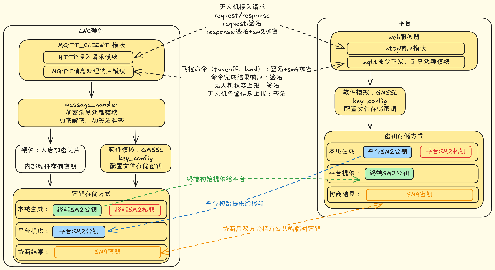
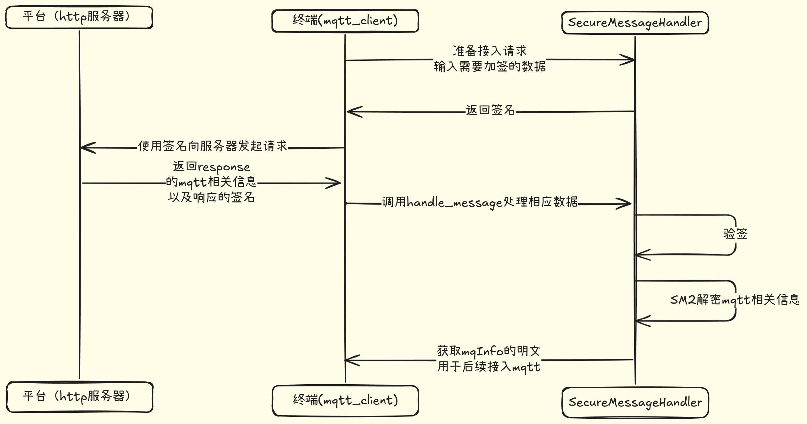
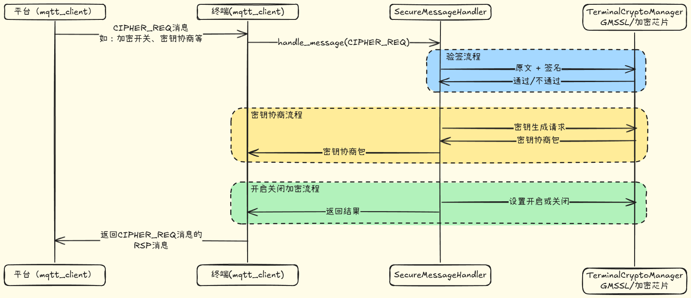
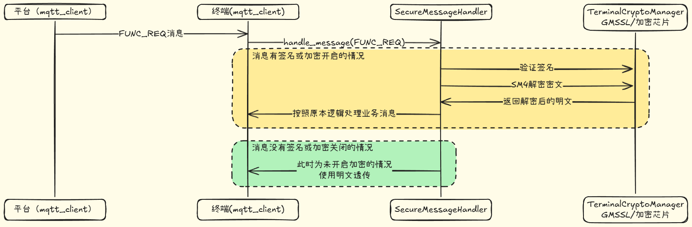

# 安全通信适配层开发项目
> 用于简历补充材料，聚焦方案设计能力与工程落地能力。本文不包含真实密钥、账号口令、生产地址、设备标识及可复现攻击细节。

---

## 1. 项目背景

在终端与平台的协同场景中，需要同时满足两类通信需求：
- **HTTP 认证链路**：完成终端身份认证与会话初始化。
- **MQTT 业务链路**：承载控制指令、状态上报与事件通知。

由于链路中涉及身份凭据与业务指令，项目采用国密算法组合实现“安全 + 性能”的平衡：
- **SM2**：用于身份认证与密钥协商。
- **SM3**：用于摘要计算与签名输入。
- **SM4**：用于业务数据加解密。

## 2. 设计目标与原则

### 2.1 设计目标

- **安全可控**：关键密钥材料不以明文形式暴露在业务层。
- **性能可用**：高频业务数据采用对称加密，控制端到端延迟。
- **模块解耦**：上层业务不感知底层密码学细节。
- **运维友好**：支持可观测、可排障、可演进。

### 2.2 架构原则

- **低频高安全**：认证与协商阶段优先使用非对称能力。
- **高频高效率**：数据通道优先使用对称加密能力。
- **最小暴露面**：限制敏感材料在内存、日志、配置中的出现范围。
- **接口抽象稳定**：通过适配层统一封装密码调用，降低业务改造成本。

## 3. 整体架构（公开描述）

系统划分为三层：
- **业务层**：负责指令处理、状态管理与消息编排。
- **安全通信适配层**：负责签名验签、会话协商、消息加解密、异常处理。
- **密码能力层**：提供国密算法能力与安全执行环境。

该分层方案的价值：
- 业务功能与密码细节解耦，便于并行开发。
- 加密策略可替换，降低后续算法升级成本。
- 安全逻辑集中治理，便于审计与质量控制。

## 4. 核心流程（公开抽象）

### 4.1 HTTP 认证阶段

1. 终端发起认证请求并提交身份材料。
2. 平台完成身份校验并返回会话初始化参数。
3. 终端建立后续消息通道所需上下文。

### 4.2 MQTT 安全会话阶段

1. 终端与平台完成会话密钥协商。
2. 双方确认加密能力与消息安全策略。
3. 开启业务通道加密收发。

### 4.3 MQTT 业务消息阶段

1. 指令消息按安全策略进行封装。
2. 终端侧完成解密、校验与执行业务处理。
3. 处理结果按同等安全级别回传。

## 5. 工程实现亮点

- **统一适配接口**：对上层仅暴露稳定的加解密与验签能力。
- **异常分级处理**：区分认证失败、协商失败、业务解密失败等故障类型。
- **链路可观测性**：关键节点输出脱敏日志与阶段性状态码，提升排障效率。
- **配置分层治理**：将环境参数、通信参数、安全参数按职责拆分管理。

## 6. 项目产出与价值

- 完成终端侧安全通信适配方案设计与落地实现。
- 支撑 HTTP + MQTT 双通道下的安全通信闭环。
- 在保障安全目标的前提下兼顾消息处理性能。
- 形成可复用的安全通信组件，支持后续项目快速迁移。

## 7. 说明

本文为公开版本，已对以下信息做统一脱敏处理：
- 供应商名称与私有接口命名。
- 内部字段名、报文字段结构、密钥材料形态。
- 生产环境地址、设备标识、账号与证书等敏感配置。