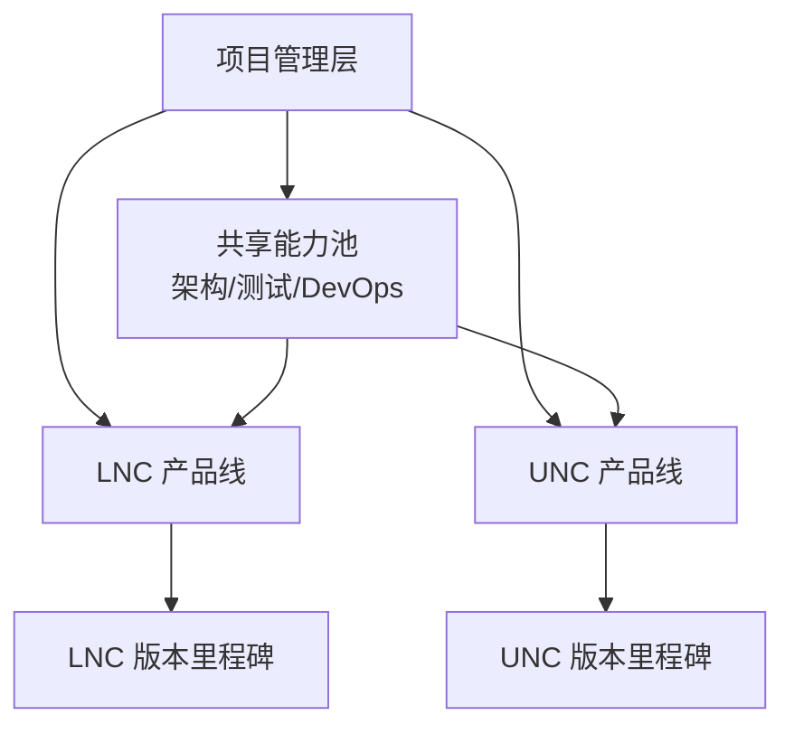
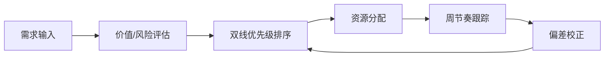
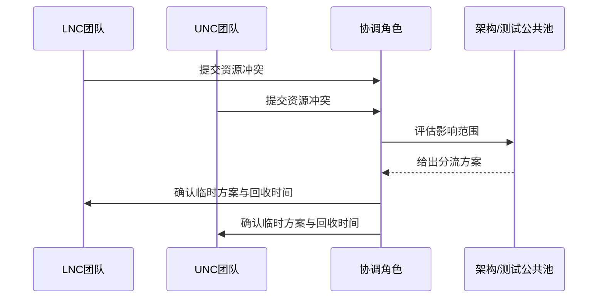

# LNC/UNC双产品线并行开发与资源协调

---

## 1. 项目背景

LNC 与 UNC 两条产品线并行推进，存在版本节奏不同、资源冲突频繁、需求优先级动态变化等问题。目标是在有限资源下实现双线稳定交付。

## 2. 目标与约束

- 双产品线按计划窗口稳定交付；
- 共享模块变更可控，降低交叉影响；
- 人员与测试资源可动态调配；
- 关键风险可提前识别与隔离。

## 3. 协同架构

## 4. 资源协调机制

### 4.1 优先级与排期机制

### 4.2 冲突处理流程

## 5. 技术与流程策略

- 分支策略分层：主干稳定、特性隔离、发布分支可追溯；
- 公共模块双线兼容：先抽象接口，再分阶段替换；
- 测试策略分层：共性回归 + 产品线专项回归；
- 周会机制：风险清单滚动更新，里程碑偏差可视化。

## 6. 项目价值

- 双线并行节奏从“被动救火”转为“可预期推进”；
- 共享资源冲突显著减少，关键任务保障能力增强；
- 版本交付与质量稳定性同步提升。

## 7. 面试讲解建议

- 先给出双线并行的复杂度，再讲你如何设计“机制”而非仅靠加班；
- 突出你在优先级治理、冲突协调、风险预案中的作用；
- 用一次典型冲突处置案例说明你如何保证交付。
