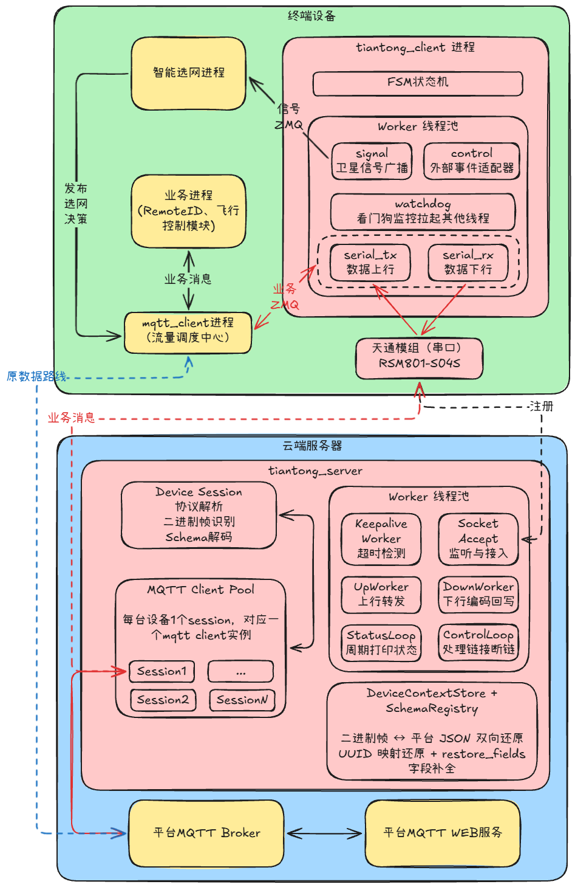
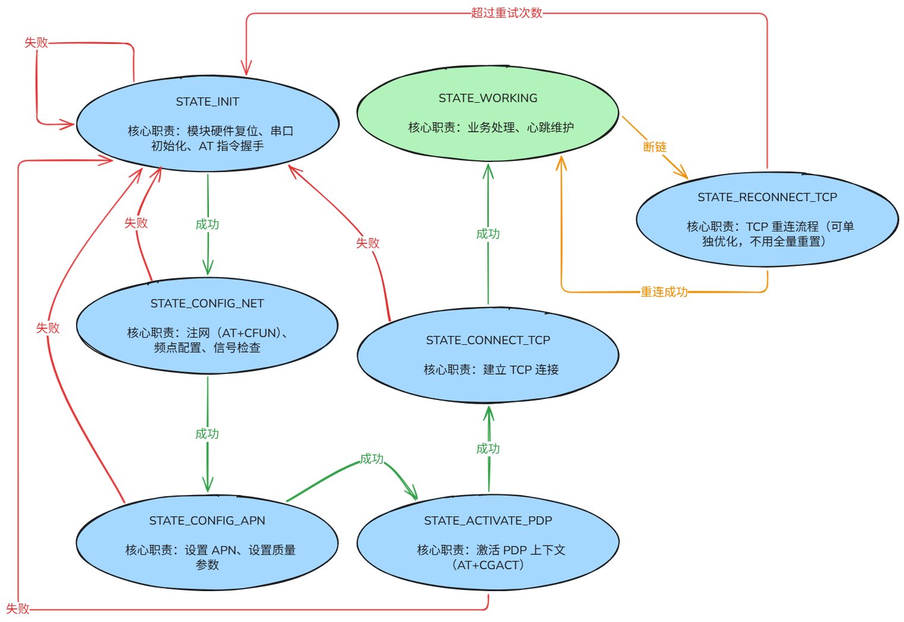
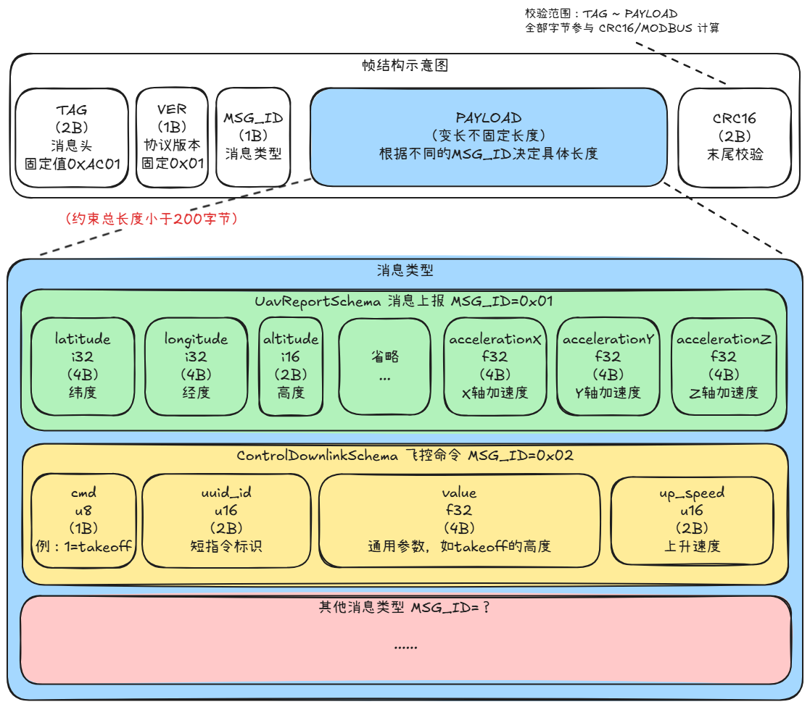
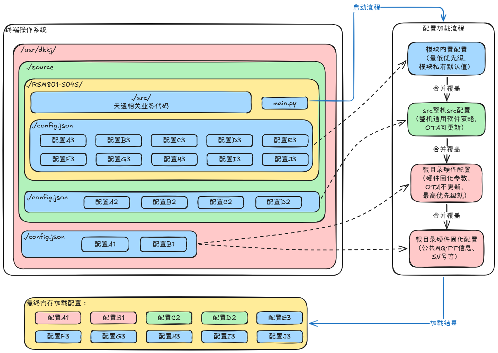
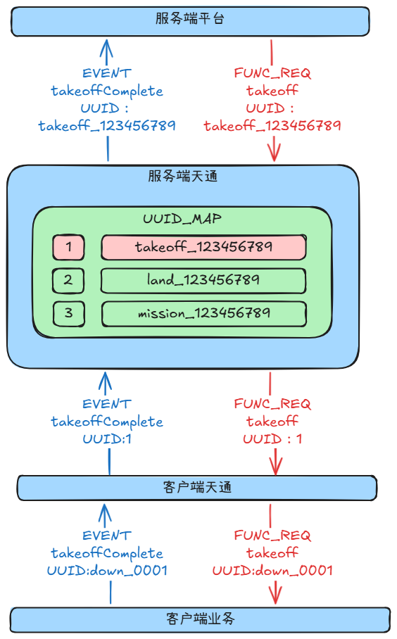

# 🌐 天通卫星通信终端与服务端 — 软件详细设计文档

---

## 1. 文档信息

| 项目名称 | 天通模组通讯链路 |
|-----------|------------------------|
| 版本号 | v3.0 |
| 日期 | 2026-06-18 |
| 状态 | 最终版 |

---

## 2. 系统概述

### 2.1 设计目标
本系统依托RSM801-S04S天通一号卫星模组搭建端云双向通信通道，实现无人机终端与云端业务平台远距离、无地面网络依赖的数据交互。整体设计围绕两大核心目标落地：
1. **链路高可靠保障**：针对天通模组搜星、入网、TCP长连接易中断的硬件特性，配套状态机自愈、看门狗监控、链路保活、异常自动重试机制，弱化卫星链路不稳定带来的业务中断风险；
2. **极致带宽优化**：受天通窄带信道小包容量限制，自研标准化二进制Schema压缩协议，在端侧对原始业务JSON报文做字段裁剪、二进制编码、长UUID截断映射，云端反向还原完整业务数据，大幅降低单包载荷体积，适配卫星信道极低运力；
3. **业务无侵入兼容**：通信层作为独立中间件运行，完全不改动存量无人机业务进程代码，对上层飞控、上报、任务控制逻辑透明无感；
4. **双链路智能调度**：兼容现有5G MQTT通信通路，基于卫星链路实时状态信号实现5G/天通双通道自动切换，保障无人机全程在线通信。


### 2.2 外部约束与硬件限制
本系统所有架构、模块、逻辑设计均受卫星模组、现有终端软件环境硬性约束，全部约束如下表：

| 约束分类 | 约束详情 | 对应设计解决方案 |
|--------|---------|----------------|
| 卫星带宽约束 | 天通单数据包有效载荷仅200~300字节，裸传完整JSON会出现分包、丢包、通信阻塞 | 终端AutoSchema二进制压缩编码、冗余字段预注册过滤、长UUID短映射压缩；云端SchemaRegistry统一补全还原字段与设备标识 |
| 链路时延约束 | 卫星往返RTT稳定1~3秒，远高于地面5G网络，高频上报易堆积消息 | 上行消息队列限流、下行指令单会话串行处理、非关键事件合并上报策略 |
| 硬件稳定性约束 | 模组搜星失败、AT指令超时、卫星TCP断连、串口异常、信号丢失等故障随机发生 | 全链路FSM有限状态机，异常自动回退初始化流程；多线程看门狗监控，卡死线程自动重启；周期保活心跳检测 |
| 业务兼容约束 | 存量飞行控制、RemoteID业务进程代码不可修改，新增卫星通信不能侵入原有业务逻辑 | 采用ZMQ进程间消息广播桥接，统一流量调度中转，业务进程仅沿用原有消息交互方式，完全不感知天通链路存在 |
| 双链路共存约束 | 终端同时运行5G MQTT通路与天通卫星通路，需根据信号质量、网络可用性动态切换通信通道 | tiantong_client实时广播卫星链路状态至独立智能选网进程，全局统一输出切换策略；所有终端进程常驻后台，摒弃启停进程的粗暴切换模式 |


### 2.3 架构总览
整套系统完整划分为**终端设备**、**云端服务器**两大独立运行域，分层边界清晰、职责完全解耦，核心顶层设计准则：`tiantong_client`、`tiantong_server`仅作为纯卫星传输管道，不承载任何业务解析、报文映射、流量调度逻辑；所有业务相关处理逻辑、压缩预处理、多链路协同调度统一收敛至终端`mqtt_client`流量调度中心。
1. 终端域：采用四常驻进程分布式协同架构，通过ZMQ统一完成进程间业务消息、链路状态信号交互；天通通信进程仅负责串口硬件驱动、二进制帧编解码、链路状态管控，与上层业务完全隔离；
2. 云端域：以`tiantong_server`卫星接入网关为核心，统一接收全网所有无人机卫星TCP连接，独立隔离每台设备会话上下文，完成压缩二进制帧与平台标准MQTT JSON双向转换，向上对接平台MQTT业务总线；
3. 全链路配套优化：端侧压缩编码、云端反向还原成对配套；链路自愈、线程隔离、设备上下文缓存、双链路调度、UUID映射缓存模块完整覆盖所有硬件短板与业务兼容需求，兼顾可靠性、带宽效率、存量代码兼容三大诉求。





### 2.4 终端&云端进程模型

系统全部业务、通信能力拆分为3个核心Python进程，各司其职、互不耦合，同时配套智能选网、无人机业务两个存量常驻进程协同工作，各进程详细职责定义如下：

| 进程名称 | 开发语言 | 核心分层定位 | 完整职责说明 |
|---------|--------|------------|------------|
| `tiantong_client` | Python | 卫星底层传输管道（端侧SDK） | 1. 串口AT指令驱动RSM801-S04S模组，完成搜星、入网、TCP长连接建立；<br>2. FSM有限状态机管理模组全生命周期，异常自动自愈重试；<br>3. AutoSchema二进制压缩/解压缩编码模块，完成业务报文二进制封包、解包；<br>4. 多隔离Worker线程池：串口收发、信号广播、AT控制、看门狗监控；<br>5. ZMQ对外提供二进制帧收发接口、卫星链路状态广播信号 |
| `mqtt_client` | Python | 终端全局流量调度中心（业务层收口） | 1. 维护终端本地MQTT上下文，对接业务进程收发原始完整JSON；<br>2. ZMQ桥接业务进程与tiantong_client，中转卫星上下行业务数据；<br>3. 业务报文预处理：UUID截断映射、冗余字段过滤，下发至卫星管道压缩；<br>4. 接收卫星链路状态信号，同步推送至智能选网进程参与双通道决策；<br>5. 统一管理终端业务消息队列、上行流量限流控制 |
| `tiantong_server` | Python | 云端卫星接入网关 | 1. TCP服务监听终端模组入网连接，为每台无人机创建独立隔离Device Session；<br>2. SchemaRegistry解码压缩二进制帧，DeviceContextStore缓存UUID映射、缺失字段配置；<br>3. 多类型Worker线程池：保活检测、上行MQTT转发、下行指令编码、链路状态管控；<br>4. MQTT Client Pool为每台设备分配独立平台MQTT会话，隔离设备流量；<br>5. 链路断连、超时离线自动清理会话上下文，释放服务端资源 |

### 2.5 核心设计原则及落地体现
整套系统所有模块、代码、交互逻辑严格遵循六大软件工程设计原则，从根源控制复杂度、规避线上隐性故障、降低后期迭代维护成本：

| 核心设计原则 | 项目内落地实现细节 |
|------------|-----------------|
| **面向接口编程** | 1. 抽象编解码基类定义统一Schema接口，所有上报、下行指令均实现独立子类；<br>2. BusinessRegistry全局报文注册中心，新增业务指令仅新增子类并完成注册，通信底层、调度层零改动；<br>3. 链路事件、状态回调统一抽象接口，新增监控事件无需修改主线程逻辑 |
| **单一职责原则** | 1. FSM状态机每个运行状态独立拆分Handler，注册、传输、故障、待机逻辑完全隔离；<br>2. Worker线程池按功能拆分：信号广播、串口收发、看门狗、保活、上行转发、下行编码，单线程仅负责一类任务；<br>3. 压缩、UUID映射、状态广播、MQTT调度分属独立模块，无跨职责耦合代码 |
| **快速失败原则** | 二进制Schema编码、帧校验、字段解析任一环节失败，直接丢弃本条消息并打印完整故障日志，不降级透传原始JSON报文，避免无效占用卫星带宽、污染云端业务数据 |
| **对业务透明无侵入** | 基于ZMQ实现消息桥接+状态广播机制，存量业务进程沿用原有消息交互格式，无需适配卫星链路、无需感知二进制压缩、无需处理模组重连逻辑，业务代码零修改 |
| **单源真理原则** | 事件标识funcName、detail映射关系仅维护一份全局源字典，程序启动自动生成正向、反向映射表，统一供给上行上报、下行解析模块使用，避免多处定义导致配置不一致、字段漏改问题 |
| **防御性编程** | 1. 全线程看门狗定时巡检，卡死、阻塞工作线程自动重启恢复；<br>2. UUID映射缓存设置自动过期清理策略，防止内存无限累积；<br>3. 卫星链路、串口信号周期巡检，断连、无响应自动触发重连流程；<br>4. 消息队列设置长度上限，避免高频上报堆积内存溢出；<br>5. 所有外部输入（串口数据、MQTT报文、ZMQ消息）增加参数校验、异常捕获兜底 |

---

## 3. 终端设计 (tiantong_client)

### 3.1 进程入口 (`main.py`)

```
加载配置 → 创建 TiantongClientManager
注册 SIGTERM/SIGINT 信号处理
调用 manager.run() 阻塞执行
```

### 3.2 总控管理器 (`manager.py`)

`TiantongClientManager` 是终端侧的核心中介者，职责包括：

| 职责 | 说明 |
|------|------|
| 组件创建 | 串口、AT 客户端、频点选择器、信号监控器、ZMQ 桥接 |
| FSM 编排 | 注册 8 个状态的 handler，驱动启动序列 |
| 线程管理 | 7 个工作线程的生命周期（启动/停止/看门狗） |
| 消息路由 | 上行入 up_queue，下行分发到 local_down_queue / zmq_down_queue |
| 状态广播 | ZMQ 定时广播天通链路状态 + 文件落盘 |

**初始化组件清单：**

| 组件 | 类/模块 | 用途 |
|------|---------|------|
| Schema 注册器 | `SchemaRegistry` | 注册 9 种二进制 Schema |
| 业务注册中心 | `BusinessRegistry` | 注册编解码函数 |
| FSM | `ClientFSM` | 8 状态状态机 |
| 串口 | `SerialPort` | 线程安全串口读写 |
| AT 客户端 | `ATClient` | AT 指令发送与响应解析 |
| 频点选择器 | `FrequencySelector` | 频点发现与选择 |
| 信号监控 | `SignalMonitor` | SNR/RSSI 采样 |
| ZMQ 桥接 | pyzmq | 与 mqtt_client 进程通信 |
| 状态发布器 | `SignalZmqPublisher` | 天通链路状态广播 |
| 链路状态导出 | `LinkStatusExporter` | 写入 `/tmp/tiantong_com.json` |

**队列体系：**

| 队列 | 生产者 | 消费者 | 用途 |
|------|--------|--------|------|
| `up_queue` | ZMQ uplink / socket bridge | tcp_tx_thread | 上行消息 |
| `down_queue` | serial_rx_thread | 业务进程 (socket) | 下行消息 |
| `local_down_queue` | serial_rx_thread | 保留 | 本地下行 |
| `zmq_down_queue` | serial_rx_thread | zmq_downlink_thread | ZMQ 下行 |
| `control_queue` | 各线程 | control_thread | 异常事件 |

### 3.3 状态机 (FSM)

#### 3.3.1 状态定义

| 状态 | 操作 | 成功条件 | 失败处理 |
|------|------|---------|---------|
| INIT | 串口打开、AT 握手、频点发现 | AT OK | 重试 INIT |
| CONFIG_NET | 锁频、CFUN 激活、CREG 检查、信号质量检查 | CREG 注册 + SNR ≥ min_snr | → INIT |
| CONFIG_APN | CGDCONT、CGEQREQ 配置 | OK | → INIT |
| ACTIVATE_PDP | CGACT 激活，等待 +CGEV ACT URC | 获取 IP | → INIT |
| CONNECT_TCP | RIOPEN 建立 TCP 连接 | +RIOPEN: 0,0 | → INIT |
| REGISTER | 发送 register，等待 ACK（含重试） | register_ack(ok=true) | → INIT |
| WORKING | 启动工作线程、业务通信 | — | → REGISTER / INIT |
| RECONNECT_TCP | RICLOSE + RIOPEN 重连 | +RIOPEN: 0,0 | → INIT |

#### 3.3.2 状态转移表



#### 3.3.3 重试策略

| 状态 | 最大重试次数 | 失败后 |
|------|------------|--------|
| INIT | 3 | 保持在 INIT 报错 |
| CONFIG_NET | 3 | → INIT |
| CONFIG_APN | 3 | → INIT |
| ACTIVATE_PDP | 3 | → INIT |
| CONNECT_TCP | 3 | → INIT |
| REGISTER | 3 | → INIT |
| WORKING | 0（不重试） | → REGISTER / INIT |
| RECONNECT_TCP | 3 | → INIT |

#### 3.3.4 注册握手

进入 REGISTER 状态时，通道层向服务端发送 register 消息：

```json
{
  "type": "register",
  ......
}
```

服务端必须回发 register_ack：

```json
{
  "type": "register_ack",
  ......
}
```

终端**仅在**收到 `ok=true` 的 ACK 后进入 WORKING。

#### 3.3.5 异常恢复机制

| 异常 | 检测方式 | 恢复动作 |
|------|---------|---------|
| TCP 断链 | +RIURC: "closed",0 / RISENDEX ERROR | WORKING → REGISTER |
| 信号差 | SNR < 5.0 连续 3 次 | control_queue → signal_poor → REGISTER |
| 下行空闲超时 | watchdog 巡检（默认 120s） | control_queue → downlink_idle_timeout → INIT |
| 线程退出 | watchdog 巡检（默认 5s） | 通过 thread_factories 重建并启动 |
| AT 发送错误 | AT 返回 ERROR | control_queue → at_error（不触发重连） |

#### 3.3.6 REGISTER 阶段门控

- 上行业务消息直接丢弃（不缓存）
- 下行业务消息直接丢弃（不缓存）
- 仅处理 register_ack 与注册控制事件

### 3.4 后台线程 (Worker)

#### 3.4.1 serial_rx 下行解析流程（职责链模式）

```
串口原始数据
  → 尝试 _dispatch_binary_hex（AC01 开头 → 二进制帧）
  → 尝试 decode_raw_hex_text + _dispatch_binary_hex（RAWIP 中提取 HEX）
  → 尝试 DOWNLINK: 前缀 → JSON 下行
  → 尝试 JSON 解析 → register_ack / type=down
  → 尝试 parse_urc → URC 事件
  → 尝试 _extract_register_ack_obj → RAWIP 中的 ACK
```

#### 3.4.2 tcp_tx 上行重试策略

| 参数 | 默认值 | 说明 |
|------|--------|------|
| 最大重试次数 | 5 | 可配置 |
| 退避间隔 | [1, 2, 4, 8] 秒 | 可配置 |
| 中断条件 | REGISTER 状态变化 | 未注册时中断重试 |

#### 3.4.3 watchdog 监控项

| 监控项 | 周期 | 动作 |
|--------|------|------|
| 线程存活 | 5s | 自动重启异常退出的线程 |
| 下行空闲 | 120s | 投递 downlink_idle_timeout → INIT |
| 心跳日志 | 5s | 输出队列积压、发送统计、线程状态 |

#### 3.4.4 control 事件处理

| 事件类型 | 处理动作 |
|---------|---------|
| `at_error` | 记录日志，不触发重连 |
| `at_send_error` | 记录日志 |

### 3.5 AT 指令层

#### 3.5.1 AT 客户端 (`at_client.py`)

- 独立 reader 线程持续读取串口
- `send(cmd, timeout)`：发送指令并等待 OK/ERROR，带 tail_collect 延迟
- `read_nonblocking(n)`：无竞争时读取未消费的串口数据
- `query_error()`：查询 `AT+RIGETERROR`
- 内部缓冲区自动压缩防内存泄漏

#### 3.5.2 串口封装 (`serial_port.py`)

- 线程安全读写（`threading.Lock`）
- 异常时自动失效句柄，确保后续 open() 可重建
- lazy import pyserial

---

## 4. 服务端设计 (tiantong_server)

### 4.1 进程入口 (`main.py`)

```
加载配置 → 创建 TcpServerManager
注册 SIGTERM/SIGINT 信号处理
调用 manager.run() 阻塞执行
```

### 4.2 TCP 服务管理器 (`tcp_server_manager.py`)

`TcpServerManager` 是服务端侧的核心中介者，职责包括：

| 职责 | 说明 |
|------|------|
| TCP 监听 | accept 线程循环接入设备连接 |
| 会话管理 | 创建/维护/销毁 DeviceSession |
| MQTT 客户端池 | 每设备一个 MQTT 客户端 |
| 注册处理 | HTTP 注册 → MQTT 创建 → 设备上下文建立 |
| Worker 编排 | up_worker / down_worker / keepalive_worker / control_loop |

**初始化组件：**

| 组件 | 用途 |
|------|------|
| `SchemaRegistry` | 注册所有二进制 Schema（9 种） |
| `BusinessRegistry` | 注册业务编码/解码函数 |
| `MqttClientManager` | MQTT 客户端池管理 |
| `DeviceInfoStore` | 设备信息 JSON 持久化 |
| `DeviceContextStore` | 设备上下文存储 |

### 4.3 设备会话 (`session.py`)

**DeviceSession 职责：**
- 逐行读取 TCP 数据
- 自动识别二进制帧（AC01）和 JSON 行
- 注册处理 → HTTP 注册触发 → register_ack 回发
- 上行消息入 up_queue
- 下行消息通过 `send()` 方法发送

**消息处理（`_handle_msg`）：**

| 消息类型 | 处理逻辑 |
|---------|---------|
| `register` | 验证身份 → 触发 on_register 回调 → 回发 register_ack |
| `ctrl` | 入 ctrl_queue（connect_mqtt/disconnect_mqtt） |
| `up` | 解析 EVENT 中的 uuid（down_ 前缀 → 还原长 uuid）→ 入 up_queue |
| `FUNC_REQ` | connect_mqtt/disconnect_mqtt → ctrl_queue；其他 → up_queue |

**二进制帧处理（`_normalize_msg`）：**
- MSG_ID=0x05/0x06（PING/PONG）→ 刷新活动时间，不入业务队列
- 通过 SchemaRegistry 解码 + DeviceContext 还原为平台 JSON
- EVENT 类型 → `iot/event/0/{project_id}/{device_name}`
- 其他 → `iot/property/{project_id}/{device_name}`

**无换行帧解析（`_try_parse_no_newline_frame`）：**
- 场景 1：ASCII HEX 帧（如 `AC0101...`）
- 场景 2：原始二进制帧
- 场景 3：二进制数据带脏前缀（扫描 AC01 TAG）

**保活机制：**

| 属性 | 说明 |
|------|------|
| `last_activity` | 最后活动时间，每次收包更新 |
| `timeout_sec` | 超时阈值（默认 120s），超时后 close() |
| `ping_interval` | PING 发送间隔（默认 30s） |
| `send_ping()` | 发送 PONG 帧（MSG_ID=0x06，含时间戳） |

### 4.4 注册与上下文

#### 4.4.1 注册流程

```
TCP 连接建立
  → 收到 register 消息
  → HTTP 注册（获取 MQTT 参数）
  → 创建 MQTT 客户端 + 自动 connect
  → 建立 DeviceContext（project_id/device_name/boot_time 等）
  → 回发 register_ack
  → 后续二进制帧通过 Schema + Context 还原为平台 JSON
```

#### 4.4.2 HTTP 注册

```python
register_client.register_device(device_id, device_secret, product_key)
# 返回 mqInfo: {mqIp, mqPort, mqUsername, mqPassword, projectId}
```

返回的 mqInfo 覆盖本地 MQTT 配置，实现动态接入。

#### 4.4.3 设备上下文 (DeviceContext)

服务端维护每个设备的上下文，用于二进制帧还原：

```python
ctx = {
    "device_name": device_id,
    ......
}
```

### 4.5 MQTT 客户端管理 (`mqtt_client_manager.py`)

| 功能 | 说明 |
|------|------|
| `DeviceMqttClient` | 单个设备的 MQTT 客户端封装 |
| `MqttClientManager` | 多设备 MQTT 客户端池 |
| client_id 格式 | `{device_id}@{device_secret}_tiantong`（`_tiantong` 后缀与 5G 链路区分） |
| 下行订阅 | 自动订阅 `down_topic`（`iot/service/request/{project_id}/{device_id}`） |
| 连接等待 | `connect_wait_sec` 内等待 connack，超时不阻断主流程 |

### 4.6 上行 Worker (`workers/up_worker.py`)

- 从 up_queue 消费消息
- 按 `device_id` 找到对应 MQTT 客户端并 publish
- 自动重启（外层 try/except + sleep 0.5s）

### 4.7 下行 Worker (`workers/down_worker.py`)

**下行编码优先级（职责链模式）：**

```
MQTT 下行消息
  → 1. business_registry.encode() 业务编码器
       ├─ FUNC_REQ 类型 → 按 cmd 分发到对应 Schema
       │  ├─ takeoff/land/rtl/loiter/obstacle → ControlDownlinkSchema (0x02)
       └─ 非 FUNC_REQ → 跳过

  → 2. 显式 schema_msg_id 直接编码

  → 3. 回退 encode_down_message_values 紧凑 JSON
```

### 4.8 保活 Worker (`workers/keepalive_worker.py`)

- 定期检查所有 session 的超时状态
- 超时的 session → close + MQTT disconnect/remove + 从 session_map 移除
- 到 PING 间隔的 session → 发送 PING 帧

---

## 5. Common 公共基础模块设计
### 5.1 底层二进制帧与 AutoSchema 协议规范
本章定义端云统一二进制传输标准，用于压缩飞控业务JSON，适配天通200~300字节小包带宽限制；采用抽象Schema面向接口扩展，新增指令无需修改底层帧解析逻辑。

#### 5.1.1 整体帧头结构



#### 5.1.2 通用枚举映射规则（EVENT / DETAIL 单源字典）
1. 设计思路：单源真理，一份字典正反自动生成映射，杜绝多处硬编码不一致
2. EVENT_MAP / DETAIL_MAP 核心代码片段

```python
# 唯一源头（驼峰格式）
EVENT_MAP = {
    "cmdReceived": 1, "cmdCompleted": 2,
    ......
}
```

3. 未知字段兜底规则（unknown=999）

#### 5.1.3 Schema 抽象扩展接口 interface.py
1. 抽象基类代码

```python
class MessageSchema(ABC):
    @abstractmethod
    def msg_id(self) -> int: ...
    @abstractmethod
    def fields(self) -> List[FieldDef]: ...
    @abstractmethod
    def encode(self, data: Dict) -> bytes: ...
    @abstractmethod
    def decode(self, payload: bytes) -> Dict: ...
```

新增一种指令类型只需新增一个 Schema 子类，编解码器、帧组装、注册全部自动完成。

2. 扩展优势说明：新增报文仅新增子类，底层组帧、解析、注册逻辑无改动，贴合面向接口设计原则
---

### 5.2 多层覆盖配置加载器 `config_loader.py`
#### 5.2.1 分层优先级（从高到低，上层覆盖下层同名配置项）
1. **根目录硬件固化配置（最高优先级，OTA不更新）**
    存放出厂绑定硬件的不可变参数：设备identity、串口端口、硬件频点、模组硬件标识；设备OTA升级软件包不会包含此文件，升级不会覆盖硬件出厂配置，保障设备鉴权、串口通信永久稳定。
2. **src全局整机配置（第二优先级，OTA可更新）**
    整机通用通信策略参数：FSM状态机重试次数、卫星带宽阈值、ZMQ进程通信地址、信号质量阈值、双链路选网策略；随软件版本OTA同步更新，可脱离硬件配置完成整机仿真测试。
3. **模块内置默认配置（最低优先级，OTA可更新）**
    tiantong_client/tiantong_server模块私有基础默认参数，仅作为模块独立运行兜底；支持单模块拆分自测，无需加载整机完整配置即可启动调试。

#### 5.2.2 核心加载合并逻辑
1. 加载顺序由低优先级→高优先级：先读取模块内置config → 合并src整机配置（覆盖冲突key） → 合并根目录硬件配置（覆盖冲突key）；
2. 三层配置合并完成后统一执行参数校验：数值范围拦截、必填项缺失告警/填充兜底、旧版RSM801 identity配置兼容转换；
3. 冲突排查能力：启动时日志打印三层原始配置+最终合并运行配置，快速定位参数覆盖冲突问题。

#### 5.2.3 流程图



### 5.3 UUID单向短标识映射管理器
#### 5.3.1 设计背景
云端平台下发飞控指令携带超长唯一UUID作为指令句柄，天通卫星单包有效载荷仅200字节，完整长UUID会占用大量传输空间，挤压飞行业务数据；
同时终端业务进程仅临时中转UUID、回执时原样回传，无需持久持有原始长UUID，因此采用**服务端单向映射压缩**方案，终端仅做简单标识格式化，不存储完整UUID映射关系。

#### 5.3.2 端云完整流转流程
1. **云端下行映射压缩**
tiantong_server接收平台MQTT下行指令，提取原始超长UUID；维护 `uint16数字ID → 原始长UUID` 单向映射缓存，分配1~65535区间无重复数字；卫星下行二进制帧仅传输2字节数字短ID。
2. **终端本地标识格式化**
tiantong_client将数字透传给mqtt_client，客户端拼接固定前缀`down_`，生成本地临时句柄如`down_0001`，交付业务进程使用。
3. **终端上行回执剥离**
业务执行完成后，事件/ACK报文原样带回`down_0001`；mqtt_client剥离前缀提取纯数字，仅将数字通过卫星上行传回云端。
4. **云端还原原始UUID**
tiantong_server根据上行数字查表，取出缓存的原始完整UUID，替换报文后转发平台MQTT，完成指令匹配与日志溯源。



#### 5.3.3 资源与内存防护设计
1. 映射缓存仅部署在云端tiantong_server，终端无任何UUID映射存储，终端内存零额外占用；
2. 服务端映射条目配置TTL过期清理，指令回执完成/超时无应答后自动释放数字ID，循环复用，避免ID耗尽；
3. 数字采用uint16存储，取值范围1~65535，满足无人机并行指令业务上限。

#### 5.3.4 分层职责约束
1. tiantong_server：唯一持有UUID映射缓存，负责长UUID与数字短ID互转；
2. mqtt_client：仅做`down_`前缀拼接/剥离，无持久化存储逻辑；
3. tiantong_client卫星管道：仅透传纯数字二进制载荷，不感知UUID业务语义，保持纯传输管道定位；
4. 上层业务进程：全程仅操作`down_xxxx`格式临时句柄，无需感知原始长UUID与链路压缩逻辑，业务代码零修改。


### 5.4 全局日志模块设计 `log.py`
1. 统一日志分级、字段模板（自动注入设备SN、链路状态、线程名）
2. 文件轮转、链路独立日志落盘策略
3. 调试/生产环境日志级别切换配置
4. 链路状态JSON导出、信号采样持久化配套日志

### 5.5 分层自定义异常体系 `exceptions.py`
1. 顶层基础异常基类
2. 硬件类异常：串口异常、AT指令异常、模组通信异常
3. 协议类异常：帧解析失败、Schema校验错误、载荷超长
4. 链路类异常：TCP断连、注册超时、下行空闲超时
5. 业务辅助异常：UUID映射缺失、配置加载失败

### 5.6 通用工具辅助函数
1. 时间戳转换、HEX/二进制互转工具
2. 消息长度校验、载荷边界判断
3. 频点持久化读写、JSON序列化通用方法


## 6. 多链路选网与 ZMQ 桥接

### 6.1 架构

```
业务进程 ←→ Unix Socket ←→ mqtt_client 进程 ←→ ZMQ ←→ tiantong_client 进程
```

- `mqtt_client` 作为统一的"流量调度中心"
- 业务进程**零改动**，不需要知道天通的存在
- 链路切换对业务完全透明

### 6.2 选网模型

选网模块通过 ZMQ 广播 `active_link` 状态，`mqtt_client` 和 `tiantong_client` 各自订阅。

| 链路 | 上行路径 | 下行来源 |
|------|---------|---------|
| `mqtt` | → MQTT broker | MQTT broker → socket 广播 |
| `tiantong` | → ZMQ → tiantong_client | ZMQ bridge 天通下行 → socket 广播 |
| `rtl` | 丢弃 | 无 |

### 6.3 选网过滤

**MQTT 下行过滤（`_on_message`）：**
- `active_link=tiantong` 时，MQTT 下行的 FUNC_REQ 不广播（天通链路自行下发）
- 避免 5G 和天通同时下发同一条指令

**天通下行过滤（`_tt_downlink_loop`）：**
- `active_link!=tiantong` 时，天通 ZMQ bridge 的下行不广播
- 避免链路切换后残留的天通下行干扰

### 6.4 ZMQ 桥接

| 端点 | 方向 | 用途 |
|------|------|------|
| `to_tiantong_endpoint` (PULL) | mqtt_client → tiantong_client | 上行消息 |
| `from_tiantong_endpoint` (PUSH) | tiantong_client → mqtt_client | 下行消息 |

### 6.5 状态广播

| 通道 | 周期 | 内容 |
|------|------|------|
| ZMQ `tiantong/status` | 1s | state, fsm_state, snr, tcp_connected |
| 文件 `/tmp/tiantong_com.json` | 1s | 同上 |

---

## 7. 数据流详解

### 7.1 上行流（状态上报）

```
业务进程
  → Unix socket JSON: {"type":"up","topic":"iot/property/...","payload":"{...}"}
  → mqtt_client 判断 active_link
     ├─ mqtt: 直接 MQTT publish
     └─ tiantong: ZMQ → tiantong_client
        → up_queue
        → tcp_tx_thread
        → send_business_message()
           ├─ schema_msg_id 指定 → SchemaRegistry.encode → build_frame → AT+RISENDEX
           ├─ DEVICE_REPORT → UavReportSchema.encode → build_frame → AT+RISENDEX
           ├─ EVENT → EventReportSchema.encode → build_frame → AT+RISENDEX
           └─ 其他 → 直接丢弃（不支持 JSON 降级）
        → 天通模组 → 卫星 TCP
        → 服务端 session
        → Protocol.parse_line (识别 AC01 或 JSON)
        → Schema.decode + DeviceContext → 平台 JSON
        → up_queue → up_worker → MQTT publish
```

### 7.2 下行流（控制指令）

```
平台 MQTT
  → MQTT Client on_message
  → down_queue
  → down_worker
     ├─ 1. business_registry.encode() 业务编码
     │     FUNC_REQ → 按 cmd 路由到对应 Schema → build_frame
     ├─ 2. 显式 schema_msg_id 直接编码
     └─ 3. 回退 encode_down_message_values 紧凑 JSON
  → session.send → TCP
  → 天通卫星
  → 终端 serial_rx_thread
  → parse_frame → Schema.decode → down_queue
  → Unix socket → 业务进程
```

### 7.3 注册流

``` 
终端 CONNECT_TCP 成功
  → 进入 REGISTER 状态
  → 发送 register JSON
  → 服务端 session._handle_msg
  → on_register 回调
  → HTTP 注册（获取 MQTT 参数）
  → 创建 MQTT 客户端 + connect
  → 建立 DeviceContext
  → 回发 register_ack(ok=true)
  → 终端收到 ACK → 进入 WORKING
  → 开始转发业务消息
```

---

## 8. 可靠性设计

### 8.1 上行重试

| 参数 | 默认值 |
|------|--------|
| 最大重试次数 | 5（可配置） |
| 退避策略 | 1s / 2s / 4s / 8s（可配置） |
| 失败处理 | control_queue 投递 send_failed 事件 |

### 8.2 下行保活

| 参数 | 默认值 |
|------|--------|
| PING 间隔 | 30s |
| 会话超时 | 120s |
| PING 帧 | MSG_ID=0x06，5B payload |

### 8.3 注册 ACK 可靠性

| 参数 | 默认值 |
|------|--------|
| ACK 超时 | 3s |
| 注册最大重试 | 3 |
| 重试退避 | 1s / 2s / 3s |
| 准入条件 | 收到 register_ack(ok=true) |

### 8.4 线程看门狗

- 巡检间隔：5s
- 检测到线程退出后通过 thread_factories 重建
- 支持自动重启的线程：serial_rx, tcp_tx, tcp_rx_dispatch, signal, control

### 8.5 服务端 worker 异常保护

- down_worker / up_worker 外层 try/except 捕获未预期异常
- 异常后 sleep 0.5s 自动重启

### 8.6 REGISTER 阶段门控

- 上行业务消息直接丢弃（不缓存）
- 下行业务消息直接丢弃（不缓存）
- 仅处理 register_ack 与注册控制事件

---