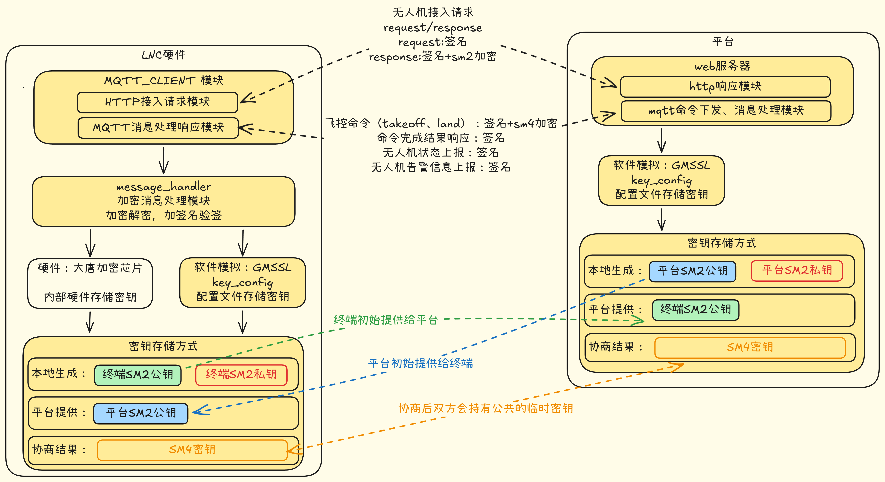
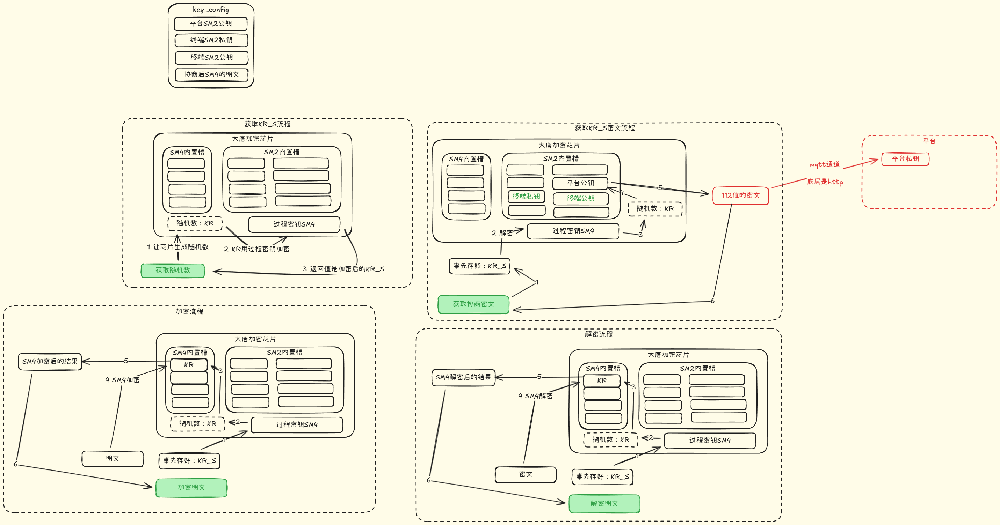
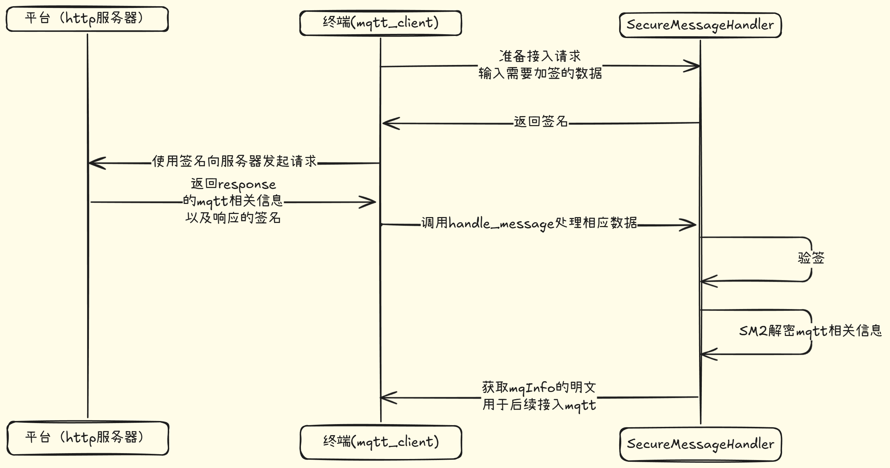
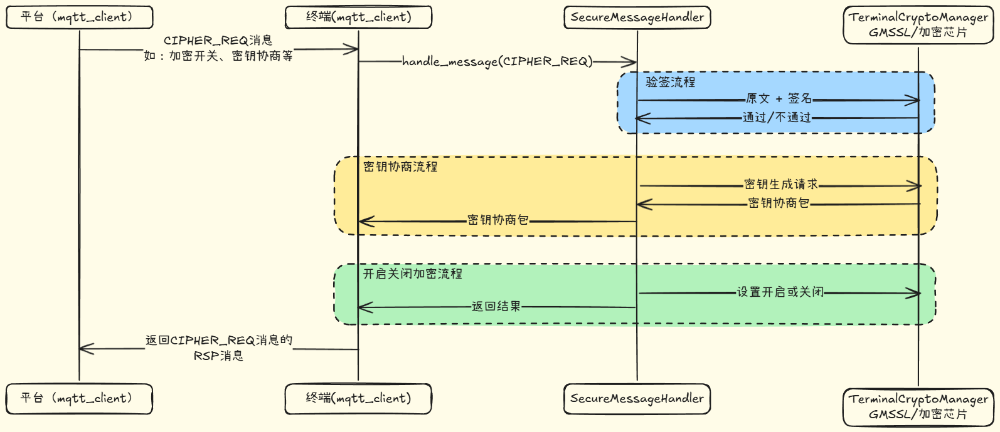
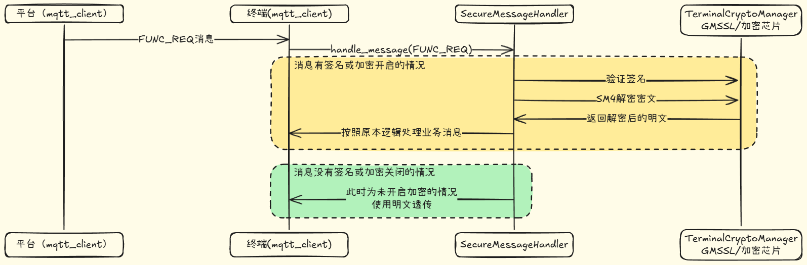

# 安全通信适配层开发项目
> 目标：说明“终端（无人机/网关）与平台”在 HTTP 认证 + MQTT 指令链路上的国密安全方案（SM2/SM3/SM4），以及当前代码实现的模块边界、数据流与可运维性。

---

## 1.  背景

终端（无人机/网关）需要与平台完成：
- **HTTP 认证**：获取 MQTT 连接信息（`mqInfo`）
- **MQTT 控制链路**：接收控制指令、上报事件/状态

链路包含账号、会话密钥与业务指令等敏感信息，引入国密体系：
- **SM2**：身份认证与密钥协商
- **SM3**：摘要（签名输入）
- **SM4**：业务数据加解密

工程取舍：
- **SM2** 保障身份与密钥安全
- **SM4** 保障性能与吞吐
- **SM3** 作为签名摘要输入

### SM2 / SM3 / SM4 基础知识

**SM2（非对称：签名/验签、加密/解密）**
- 用公钥验证身份/完整性，用私钥签名与解密。
- 安全性依赖椭圆曲线难题，难以伪造与反推私钥。

**SM3（哈希/摘要）**
- 生成固定长度摘要，用作签名输入与完整性校验。
- 单向与抗碰撞特性降低被篡改风险。

**SM4（对称：业务数据加密/解密）**
- 使用会话密钥进行高性能加解密，适合高频业务数据。
- 密钥不泄露且 IV 合理即可保障安全性。

### 安全芯片方案为什么安全（核心结论：SM4 密钥不明文出芯片）

本方案引入安全芯片的核心价值是“把密钥从软件内存与磁盘中隔离出去”，降低密钥泄露面：

- **SM4 会话密钥（KR）在芯片内生成与留存**：终端侧拿到的是加/解密结果与必要的密钥交换材料，而不是会话密钥明文。
- **本地落盘只保存密文形态**：
  - 终端侧配置文件中保存的是经“过程密钥（芯片内部 SM4）”封装加密后的 `KR_S`（会话密钥的密文形态），即使文件被拷走也无法还原 `KR`。
  - 用于发给平台侧的密钥交换报文（图中“112 位密文”）是经平台 SM2 公钥进一步封装/加密的密文，只有平台持有对应私钥才能解开。
- **攻击面收敛**：
  - 攻击者截获通信链路或拿到配置文件，只能得到密文材料；缺少芯片内过程密钥或平台私钥，无法恢复会话密钥。
  - 上层业务进程无需接触会话密钥明文，减少因日志、core dump、内存扫描带来的泄露风险。

该模块的定位是“安全通信适配层”：上层业务只关心指令/参数，不需要了解签名串、SM4 密文格式、协商状态等协议细节。

## 2. 安全与性能取舍

### 2.1 为什么用 SM2 做认证/协商

- **身份可信**：SM2 签名/验签提供不可抵赖性，保证指令来源与完整性。
- **密钥安全**：协商阶段使用 SM2 保护会话密钥材料，避免明文暴露。
- **合规要求**：满足国密体系在身份与密钥管理上的合规需求。

### 2.2 为什么用 SM4 做业务加解密

- **性能优先**：对称算法适合高频、大流量数据，延迟更低。
- **链路稳定**：SM4 + 随机 IV 适配 MQTT 业务消息的连续传输。
- **工程成本可控**：加解密接口简单，便于封装与复用。

### 2.3 组合策略（SM2 + SM4）

- **SM2 负责“身份与密钥”**：低频协商 + 高安全。
- **SM4 负责“业务数据”**：高频消息 + 高性能。
- **整体收益**：在安全与性能之间取得平衡，且便于审计与演进。

## 3. 软件整体架构

图 1（架构与密钥归属）：

说明：该图用于回答三个问题：密钥放哪、芯片做什么、软件怎么调用。
- **配置文件（key_config）**：保存平台 SM2 公钥、终端 SM2 私钥/公钥，以及会话密钥的密文材料（如 `KR_S`），不保存会话密钥（SM4/KR）明文。
- **大唐加密芯片**：内置 SM2/SM4 相关能力与内部密钥槽位，上层不直接操作底层密钥细节。
- **终端软件**：通过“芯片定制的四个接口”完成密钥交换与业务数据加/解密；上层业务只拿到明文/密文结果。

图 2（密钥协商 + 加解密流程）：

说明：该图描述“芯片定制四接口”如何串起密钥交换与加/解密。
- **接口 1：获取随机数 KR**：芯片内部生成随机数 `KR`（作为会话密钥素材/会话密钥），并在芯片内部留存。
- **接口 2：获取加密后的 KR_S**：芯片使用内部的过程密钥（SM4）对 `KR` 进行封装加密，输出 `KR_S`（用于后续密钥交换与存储）。
- **接口 3：获取 112 位密文（密钥交换报文）**：芯片将 `KR_S` 进一步封装为可发送给平台的密文报文（图中标注“112 位密文”），终端通过通信通道转发至平台；平台侧据此完成会话密钥相关材料的对齐。
- **接口 4：业务数据加/解密**：终端业务侧传入明文/密文，芯片基于会话密钥（由 `KR/KR_S` 派生或装载）执行 SM4 加密/解密并返回结果。

## 4. 关键流程

### 时序：HTTP 认证（register）

### 时序：MQTT 密钥协商与加密开关

### 时序：MQTT 业务指令

