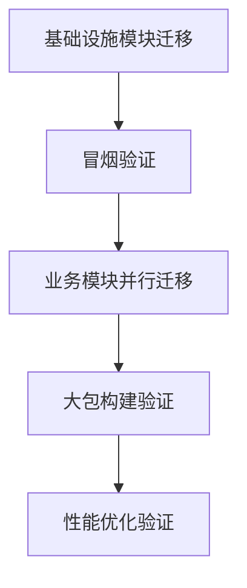
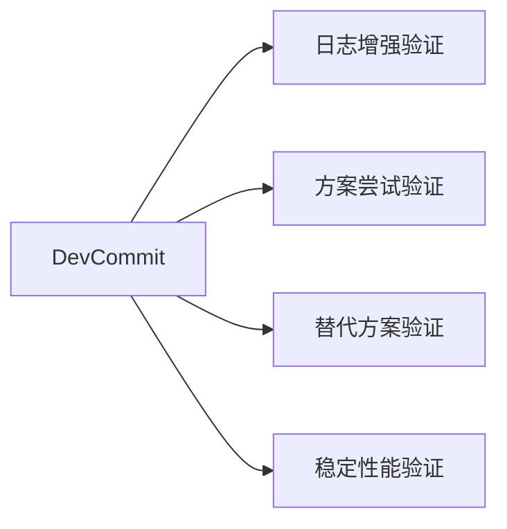
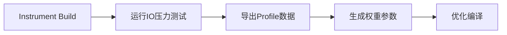

# 千万行级软件栈编译器迁移实践

## GCC → 毕昇（Clang/LLVM）Toolchain 验证项目

---

## 一、项目背景

* 产品：OceanStor 存储软件栈（集中式 IO 架构）
* 软件规模：20+代码仓，千万行级 C/C++
* 最终二进制体量：约 2GB（IO链路静态库统一打包）
* 项目目标：

  * 验证新编译器在真实生产软件栈中的可行性
  * 争取整体性能提升目标 **10%**
* 项目性质：

  * 技术探索型项目
  * 资源有限
  * 风险较高（可成功可失败）

---

## 二、核心挑战

### 1️⃣ 构建体系复杂

* 多仓自治构建脚本
* GCC编译选项高度分散
* 大包流水线链路长，反馈周期慢

### 2️⃣ 编译器行为差异

* 优化策略不同（O2/O3差异明显）
* GCC扩展依赖较重
* Undefined Behavior 在新优化策略下暴露

### 3️⃣ IO链路性能敏感

* 指令调度 / cache locality 对性能影响大
* 向量化与循环展开策略差异带来性能波动

### 4️⃣ 迁移推进难度

* 涉及多个业务部门
* 构建权限申请复杂
* 需协调专家资源决策编译选项策略

---

## 三、迁移总体策略

### 分阶段推进



迁移优先级：

1. 通信 / 内存 / 进程 / 日志等基础模块
2. IO路径核心组件
3. 上层业务协议模块

---

## 四、CI验证架构设计

### 独立流水线验证策略

* 新建隔离工程流水线
* 动态注入新编译器环境
* 避免影响现网构建链路



### 并行验证方法论

为降低流水线反馈周期，设计：

* **问题定位分支**
* **尝试性修复分支**
* **对比方案分支**
* **稳定性能基线分支**

→ 实现单人多线程推进迁移验证。

---

## 五、编译选项治理

对历史 GCC 编译选项进行系统梳理：

| 类型   | 策略          |
| ---- | ----------- |
| 可删除  | 行为无影响       |
| 可替换  | 使用Clang等效选项 |
| 默认支持 | 无需显式指定      |
| 暂不支持 | 反馈编译器团队     |

→ 通过跨团队评审形成统一迁移策略表。

---

## 六、典型问题案例集

### 案例1：静态库链接顺序问题

**现象**

* 切换编译器后出现 `undefined reference`
* 单模块构建通过，大包链接失败

**原因**

* 静态库按顺序解析
* 新链接器行为更严格
* 存在循环依赖

**解决**

* 调整链接顺序
* 使用：

```
-Wl,--start-group ... --end-group
```

---

### 案例2：优化级别导致性能波动

**现象**

* O3性能反而下降
* IO路径延迟增加

**原因**

* aggressive loop unrolling
* cache miss增加
* 指令调度策略差异

**解决**

* 核心模块降级优化等级
* 精细化控制编译选项

---

### 案例3：Warning升级为Error

**现象**

* 构建失败但逻辑未改变

**原因**

* 编译器标准更严格

**解决**

* 分级治理warning
* 局部修复或关闭

---

## 七、PGO性能优化链路



优化点：

* 热点函数布局优化
* 分支预测优化
* 循环路径优化

---

## 八、项目成果

* 完成核心软件栈迁移验证
* 冒烟测试通过
* 性能提升约 **5%**
* 建立迁移经验文档
* 成为后续产品线迁移参考标准

---

## 九、方法论沉淀

本项目形成的工程经验：

1. 大型软件栈编译器迁移需 **分阶段推进**
2. 必须建立 **并行验证流水线机制**
3. 编译选项治理是迁移关键
4. 性能优化需结合 **PGO闭环**
5. 知识资产沉淀可显著降低组织迁移成本

---

## 十、个人角色

* 主导迁移验证方案设计
* 推动跨团队技术决策
* 设计并行CI验证策略
* 沉淀迁移方法论文档
* 支持后续产品线迁移推广
