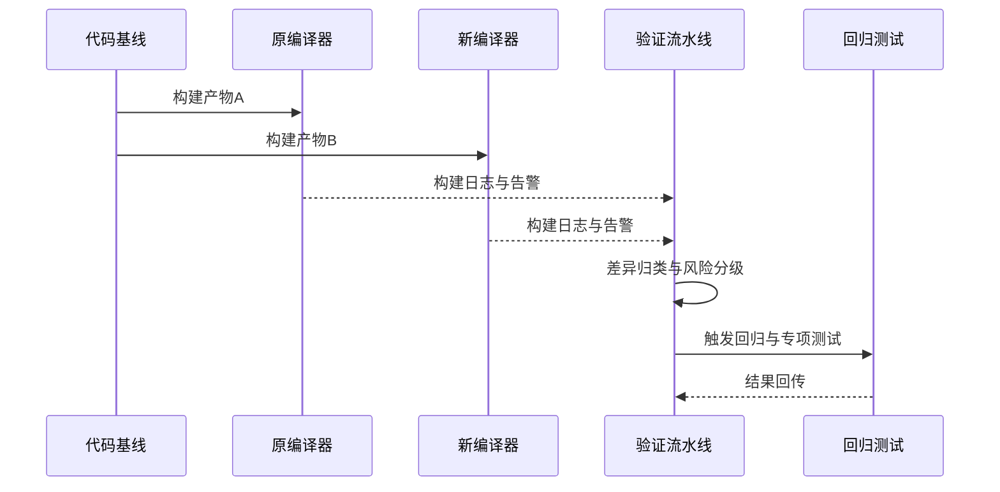

# 华为存储产品编译器替换预研项目

---

## 1. 项目背景

在存储产品演进过程中，原编译工具链在兼容性、可维护性与长期演进方面面临挑战。项目目标是在不影响现网稳定性的前提下，完成编译器替换预研与可行性验证。

## 2. 预研目标

- 评估新编译器对核心模块的兼容性影响；
- 建立可复现的迁移验证流程；
- 识别高风险语法与行为差异点；
- 输出迁移策略、改造边界与风险清单。

## 3. 技术路线

## 4. 差异分析框架

### 4.1 差异分类

- 语法差异：语言标准、扩展语法、宏行为；
- 语义差异：优化策略、未定义行为触发概率；
- 链接差异：符号解析、库兼容、ABI 风险；
- 工程差异：构建脚本、编译选项、告警基线。

### 4.2 验证流程

## 5. 风险控制策略

- 分阶段迁移：按模块与风险级别逐步推进；
- 双轨验证：关键版本保持双编译器结果对照；
- 基线冻结：在迁移窗口控制并发变更；
- 回退预案：出现关键异常可快速切回稳定方案。

## 6. 项目产出

- 编译器替换可行性评估报告；
- 高风险模块清单与改造建议；
- 迁移实施路线图与验证标准；
- 对后续规模化替换的工程方法沉淀。

## 7. 面试讲解建议

- 不只讲“换编译器”，要强调“如何控制工程风险”；
- 把重点放在差异识别、验证闭环、回退机制；
- 最后落到你对大型工程迁移方法论的理解。
