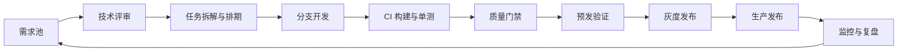
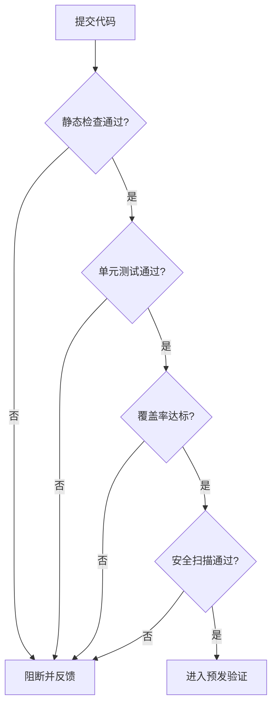
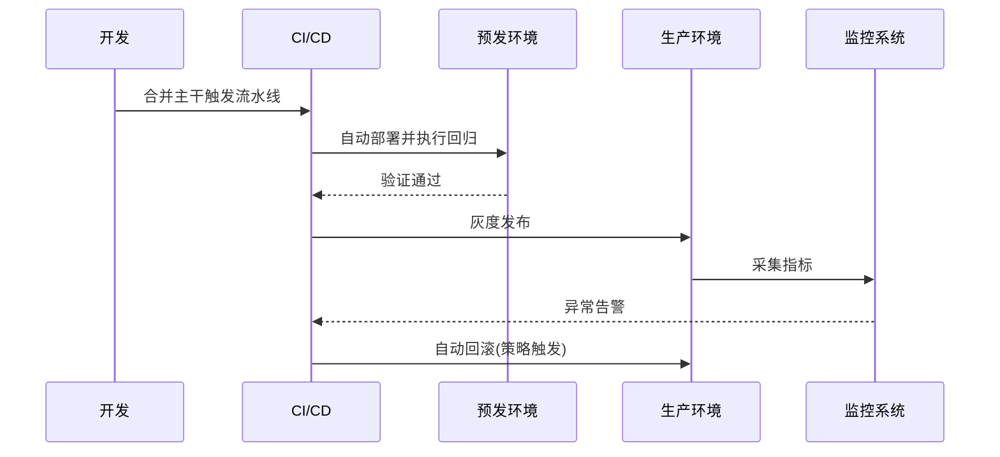

# 软件团队技术体系与研发流程从0到1建设

---

## 1. 项目背景

在团队规模扩张和业务复杂度提升阶段，原有研发流程存在以下问题：
- 需求流转依赖人工同步，跨角色信息断层明显；
- 构建、测试、发布链路不统一，交付稳定性波动较大；
- 质量问题暴露偏后，返工成本与线上风险偏高。

项目目标是从0到1建设“可复制、可度量、可持续优化”的研发技术体系。

## 2. 建设目标

- 打通需求到交付的端到端流程；
- 建立统一 CI/CD 流水线与质量门禁；
- 沉淀标准化模板，降低团队协作成本；
- 建立度量看板，支撑持续改进闭环。

## 3. 总体方案

### 3.1 三层能力建设

- 流程层：需求管理、版本策略、发布审批、故障复盘。
- 工具层：代码仓库规范、流水线编排、测试执行、制品管理。
- 治理层：质量指标、交付节奏、风险预警、责任闭环。

## 4. 关键机制设计

### 4.1 质量门禁策略

### 4.2 发布与回滚

## 5. 项目价值

- 建立统一交付标准，显著降低发布波动；
- 把质量问题前移到开发与集成阶段；
- 形成跨团队可复制的研发流程模板；
- 为后续平台化建设提供可扩展基础。

## 6. 面试讲解建议

- 先讲“为什么要建”，再讲“怎么建”，最后讲“结果如何验证”。
- 强调你在规则定义、跨团队推进、问题闭环中的主导作用。
- 结合一两个典型问题案例说明流程落地价值。
