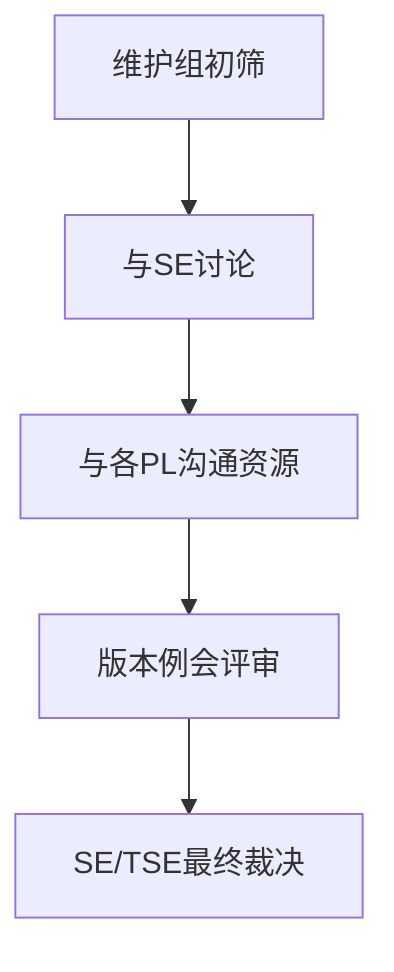
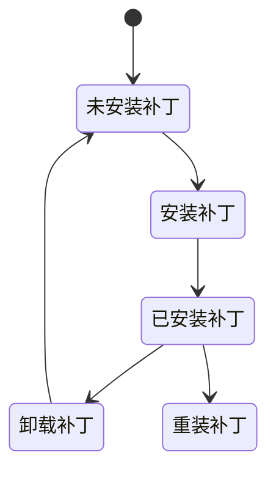

# 分布式存储补丁版本交付治理实践（SubPM）

---

## 一、角色背景

* 担任维护版本 SubPM 约一年
* 负责多个补丁版本交付治理
* 每个版本补丁数量：1 ~ 20+
* 补丁形态：分布式二进制替换补丁

---

## 二、补丁需求来源治理（Buglist机制）

建立风险驱动的补丁需求池：

### 来源

1. 现网低概率故障回溯分析
2. 在研测试发现历史版本遗留问题
3. 开发主动代码审视发现潜在风险

### 特点

* 要求开发分析影响范围
* 建立责任闭环机制
* 鼓励主动风险暴露

→ 形成持续更新的补丁候选池。

---

## 三、补丁范围优先级决策

目标：在有限版本容量内最大化风险收敛。

决策流程：

决策依据：

* 触发概率
* 业务影响范围
* 资源可投入度

---

## 四、补丁交付流水线设计

一个补丁完整生命周期：

特点：

* 多角色技术 Gate 控制风险
* 分阶段降低发布不确定性
* 强调方案透明与评审充分

---

## 五、执行过程中的工程实践

### 在线文档全流程沉淀

* 每个补丁独立在线文档
* 包含：

  * 背景说明
  * 方案设计
  * 流程图
  * 各阶段评审纪要
  * 测试策略
  * 验证截图

价值：

* 提升信息透明度
* 降低沟通成本
* 提供发布审计依据
* 降低人员依赖风险

---

## 六、个人贡献

* 主导补丁交付计划制定
* 协调跨团队技术资源
* 推动风险优先级共识
* 建立补丁文档规范体系
* 提升版本交付确定性

---

## 七、补丁发布工程实践

### 1️⃣ 补丁安装/卸载脚本模板化

补丁发布框架仅提供统一接口：

* install.sh
* uninstall.sh

为降低开发脚本质量波动：

* 设计统一脚本模板
* 开发仅需修改变量区即可完成补丁替换逻辑

工程收益：

* 降低发布失败率
* 减少开发学习成本
* 提升补丁交付一致性

---

### 2️⃣ 安装卸载状态机设计

脚本需覆盖多种运行状态：

关键设计点：

* 支持重复安装
* 支持跨版本补丁替换
* 支持异常中断恢复

---

### 3️⃣ 版本一致性保障机制

依赖产品升级框架提供：

* 升级前版本检查
* 升级后文件MD5校验
* 回滚流程完整性验证
* 子步骤失败即暂停

→ 提供事务式升级体验。

---

### 4️⃣ 补丁冲突与分支治理

补丁继承策略：

特点：

* 每个补丁基于上一版本补丁分支构建
* 保证历史修改持续累积
* 避免二进制覆盖冲突

---

### 5️⃣ 发布责任控制

* 产品二进制统一由维护负责人上传
* 建立发布 Gate 机制
* 避免未验证产物进入发布链路

---

### 6️⃣ 自动化验证探索

在人工验证成本较高背景下：

* 规划 UI驱动自动化升级验证方案
* 设想通过脚本自动触发升级/回滚流程
* 自动收集验证结果

→ 为后续发布自动化奠定思路基础。

---

## 八、紧急补丁与发布风险控制

在分支锁定（freeze）后仍可能出现重大问题。

处理方式：

* 快速问题定位
* 设计补丁方案
* 组织跨团队紧急评审
* 并行推进开发、发布、测试流程

在多次紧急补丁中承担：

* 发布路径设计
* 升级回滚验证
* 二进制产物发布
* 流程推进协调

通过并行推进关键路径工作，显著缩短补丁交付时间。

---

## 九、多补丁版本并行治理

在 SPH020 版本推进过程中：

* 因测试资源不足
* 临时从稳定版本 SPH010 拉取 SPH015 分支

导致：

* 补丁需双向合入
* 测试需重复验证
* 发布计划需重新排布

复盘结论：

* 建议采用单 Patch Train 策略
* 在当前补丁版本中动态调整补丁范围
* 后续版本继续规划新增补丁

降低分支分裂带来的工程复杂度。

---

## 十、Freeze 窗口与发布节奏管理

发布前设定代码冻结窗口：

* 控制版本稳定性风险
* 提升测试有效性

在冻结周期延长情况下：

* 通过流程并行化
* 提前完成补丁验证
* 保持季度补丁交付节奏

同时并行维护多个产品版本补丁发布。
