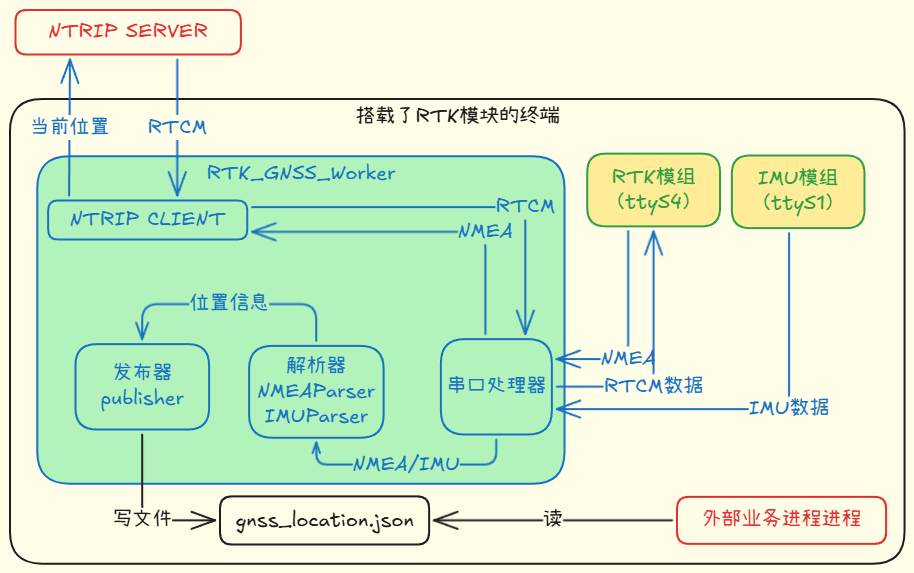
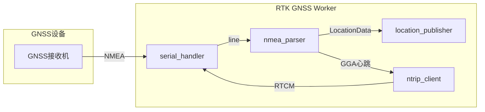

# RTK GNSS Worker - 软件详细设计文档

---

## 1. 文档信息

| 项目名称 | RTK GNSS Worker - 实时厘米级定位服务 |
|-----------|------------------------|
| 编写人 | 金英杰 |
| 审核人 | 金英杰 |
| 版本号 | v1.0 |
| 日期 | 2025-10-28 |

---

## 2. 需求背景与目标范围 📊

### 2.1 背景
RTK GNSS Worker 提供实时厘米级定位服务，面向无人机、农业自动化、测绘等场景，覆盖 NTRIP 差分接入、NMEA 解析与位置信息发布。

### 2.2 目标范围
- 支持 NTRIP（RTCM）差分数据接收并转发给GNSS接收机，实现厘米级定位精度；
- 实时解析NMEA语句（GGA/RMC/GSA等），提取位置、时间、质量与卫星信息；
- 将解析后的位置数据标准化为JSON并支持文件、网络、回调等多种发布方式；
- 不包含硬件驱动与坐标系转换（仅使用WGS84）；

---

## 3. 软件整体架构 🏗️

### 3.1 系统架构图

### 3.2 模块划分
| 模块 | 类型 | 职责简介 |
|------|------|-----------|
| ntrip_client | 网络客户端 | 连接NTRIP Caster，接收RTCM并转发到串口 |
| serial_handler | 串口管理 | 管理串口/TCP串口读取，提供 read_nmea() 等接口 |
| nmea_parser | 数据解析 | 校验并解析NMEA语句，生成 LocationData 对象 |
| location_publisher | 发布模块 | 根据配置把位置数据输出为文件/HTTP/回调/消息队列 |
| gnss_worker | 主控制守护进程 | 启动线程（NTRIP、NMEA、RTCM）、管理状态和重试策略 |

---

## 4. 模块设计 🔧

### 4.1 NTRIP 差分数据接收（ntrip_client）

#### 功能范围
* 连接NTRIP服务器并接收RTCM差分数据；
* 将接收到的有效RTCM帧转发到串口或TCP给GNSS接收机；
* 维护GGA心跳（周期性向服务器发送当前位置）以保持服务；
* 连接监控、重连策略与统计信息上报（带退避机制）。

---

### 4.2 串口与数据接入（serial_handler）

#### 功能范围
* 管理本地串口或TCP串口连接；
* 提供 `read_nmea(timeout)`、`write_rtcm()` 等接口；
* 处理粘包、断线重连与数据缓冲策略。

---

### 4.3 NMEA 数据解析（nmea_parser）

#### 功能范围
* 校验和验证NMEA语句；
* 支持 GGA、RMC、GSA 等语句解析；
* 兼容空字段格式（例如 `$GNGGA,,,,,,0,,,,,,,,*78`）并返回质量为0的 LocationData；
* 将NMEA坐标格式（DDMM.MMMMM）转换为十进制度，时间戳转为Unix时间。 

---

### 4.4 位置信息发布（location_publisher）

#### 功能范围
* 根据配置发布位置数据；
* 原子写入文件与失败重试；

---

## 5. 数据流与接口定义 📡

### 5.1 数据流图

---

### 5.2 关键数据结构（简要）

- `LocationData`：时间、经纬度、高度、质量、卫星数、HDOP、原始 NMEA。
- 配置项：NTRIP 接入、串口/网络、输出方式与刷新间隔。
- 输出格式：标准化 JSON（位置字段为主，可扩展传感器数据）。
