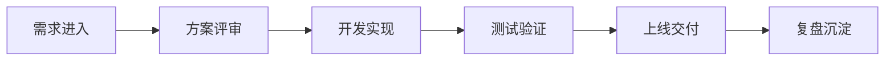
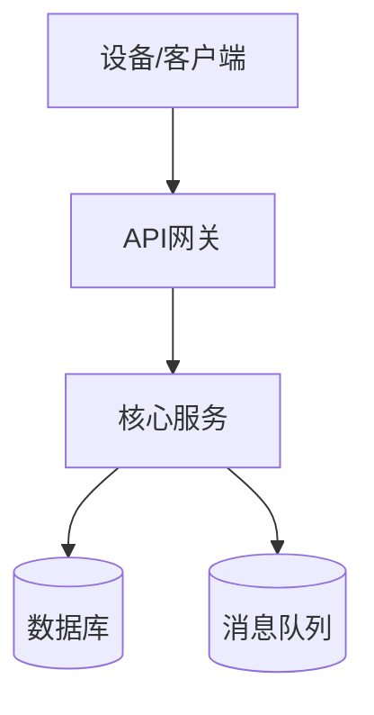

# 项目补充材料

> 用 Markdown + 图片 + Mermaid 组织项目说明。可直接替换为你的内容。

## 结构建议

- 背景/问题
- 目标（量化指标）
- 方案（架构图/流程图）
- 关键实现
- 结果与复盘
- 可复用资产

## 示例：流程图（Mermaid）

```mermaid
flowchart LR
  A[需求进入] --> B[方案评审]
  B --> C[开发实现]
  C --> D[测试验证]
  D --> E[上线交付]
  E --> F[复盘沉淀]
```

## 示例：架构图（Mermaid）

```mermaid
graph TD
  Client[设备/客户端] --> API[API网关]
  API --> Service[核心服务]
  Service --> DB[(数据库)]
  Service --> MQ[(消息队列)]
```