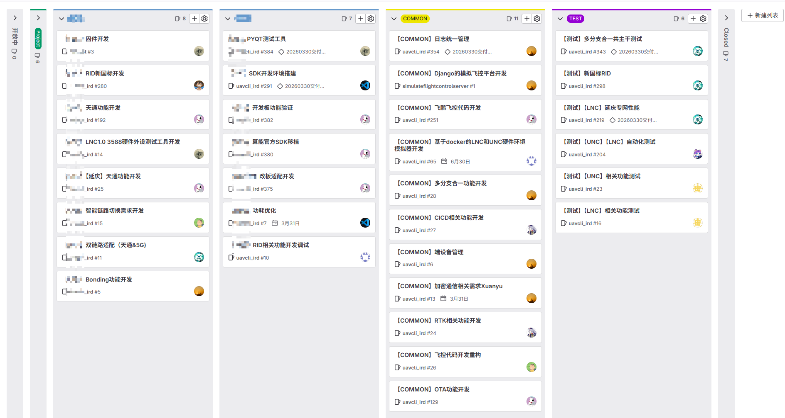

# 航天时代低空科技工程体系从0到1建设实践

## 一、版本控制体系建立

入职初期团队开发模式：

* 无统一代码仓库
* 代码通过压缩包分发
* 无版本追溯能力

推动团队引入 GitLab：

* 建立首个 tutorial 仓库
* 编写 Git 使用文档
* 组织版本控制培训

实现：

* 团队从个人开发向协作开发转型

---

## 二、Release 基线与分支治理

接收飞控代码后：

* 建立统一仓库
* 创建首个 Release Tag：重庆620

后续通过：

* feature 分支承载新终端开发
* 演示版本独立分支维护

逐步形成轻量 Release Branch 策略。
```yml
stages:
  - lint
  - test
  - version
  - deploy_unc
  - deploy_lnc
include:
  - local: 'ci/lint.yml'
  - local: 'ci/deploy_unc.yml'
  - local: 'ci/test_main.yml'
  - local: 'ci/version_bump_mr.yml'
  - local: 'ci/deploy_lnc.yml'
```
---

## 三、代码质量门禁建设

针对 Python 飞控代码质量问题：

* 引入 flake8 规范检查
* 在 GitLab CI 中配置自动检查

实现：

* 提交即触发质量验证
* Merge Request 必须通过规范检查
```yml
lint:
  stage: lint
  script:
    # 1. 统一使用项目 .flake8 配置（不要在命令行重复参数）
    - docker run --rm -v "$PWD":/workspace -w /workspace uav_python_lint:latest python -m flake8 . --format=codeclimate > gl-code-quality-report.json || true
    # 2. 生成人类可读报告（同一套配置）
    - docker run --rm -v "$PWD":/workspace -w /workspace uav_python_lint:latest python -m flake8 . | tee flake8_report.txt || true
    # 3. 生成 HTML 报告（脚本复制仍可）
    - cp ci/code_quality_viewer.py ./
    - docker run --rm -v "$PWD":/workspace -w /workspace uav_python_lint:latest python code_quality_viewer.py gl-code-quality-report.json
    # 4. 严格检查：仅致命错误，与 .flake8 保持一致
    - docker run --rm -v "$PWD":/workspace -w /workspace uav_python_lint:latest python -m flake8 . --select=E9,F63,F7,F82 --count
  tags:
    - python
  artifacts:
    reports:
      codequality: gl-code-quality-report.json
    paths:
      - gl-code-quality-report.json
      - flake8_report.txt
      - code_quality_report.html
    when: always
```
---

## 四、交付流水线打通

为解决测试取包效率问题：

* 在 CI 中新增打包 Job
* 自动上传产物至 GitLab Package Registry

形成交付链路：

开发 → CI打包 → 包仓 → 测试 OTA

显著提升测试交付效率。
```yml
deploy_unc:
  stage: deploy_unc
  variables:
    # 可配置的产品信息
    # DJI PSDK 二进制包来源：从 psdk_work 的包仓下载“最新的 arm32 包”
    # 说明：使用 CI_JOB_TOKEN 拉取，不需要额外 token（前提：GitLab 允许 job token 跨项目访问该工程包仓）
    DJI_PSDK_PROJECT_ID: "29"   # psdk_work 工程在 GitLab 的 project id
    DJI_PSDK_PACKAGE_NAME: "dji_psdk"  # 同一时间戳版本下包含 arm/arm64 文件

    # FPAPP 二进制包来源：从 fp_fsdk_work 的包仓下载“最新的大包”（内含 arm/arm64 两个 fpapp）
    FPAPP_PROJECT_ID: "44"   # fp_fsdk_work 工程在 GitLab 的 project id（请填）
    FPAPP_PACKAGE_NAME: "fpapp"

  needs: []
  before_script:
    - |
      set -e
      if [ "$(id -u)" = "0" ]; then
        apt-get update && apt-get install -y curl tar jq
      elif command -v sudo >/dev/null 2>&1 && sudo -n true >/dev/null 2>&1; then
        sudo -n apt-get update && sudo -n apt-get install -y curl tar jq
      else
        echo "WARN: 无法非交互安装依赖（无 root 且 sudo 需要密码）。假设 runner 已预装 curl/tar/jq。"
      fi
  script:
    - echo "开始构建发布包..."
    - chmod +x scripts/ci/*.sh
    - bash ./scripts/ci/deploy_unc_package.sh
  artifacts:
    paths:
      - ${PACKAGE_NAME}-*.tar.gz
      - release_info.json
    expire_in: 1 week
  rules:
    - when: manual
      allow_failure: true
  allow_failure: false
  tags:
    - TestRunner

```
---

## 五、自动化测试 Pipeline 雏形

在测试团队逐步扩充后：

* 推动自动化测试脚本接入 CI
* 支持代码提交触发自动测试

实现持续验证能力初步落地。

---

## 六、敏捷协作平台建设

替代线下玻璃墙看板：

* 使用 GitLab Issue / Label 构建任务看板
* 统一任务创建规范
* 每周跟踪 Issue 进展

推动团队进入可追踪研发节奏。



---

## 七、研发数据自动化统计

通过 CI 调用 GitLab API：

* 自动收集 Issue 活动
* 汇总成员提交情况
* 生成日报页面

并通过内部 nginx 服务发布。

初步构建研发数据可视化能力。

---

## 八、版本号自动化管理

随着多终端产品并行交付，手动维护版本号易出现遗漏和不一致问题。

为此设计并落地版本号自动化管理机制：

* 引入 `version_manager.py` 脚本，统一管理 `docs/version_registry.json`
* CI 触发后自动读取当前提交信息，完成版本字段更新
* 同步重新生成 LNC / UNC 归档 CSV 及版本发布历史记录

在 GitLab CI 中配置 `version_bump_mr` Job：

* 仅在 `main` 分支手动触发，避免意外更新
* 自动创建独立的 `version/bump-*` 分支并提交变更
* 通过 GitLab API 自动发起 Merge Request，附带标准描述，供人工审核后合并

```yml
version_bump_mr:
  stage: version
  rules:
    - if: '$CI_COMMIT_BRANCH == "main" || $CI_COMMIT_BRANCH == $CI_DEFAULT_BRANCH'
      when: manual
    - when: never
  script:
    - bash scripts/ci/run_version_bump_mr.sh
```

实现效果：

* 版本号更新有迹可查，纳入 MR 审核流程
* 消除手动维护版本的人为失误风险
* 版本历史自动归档，支撑交付溯源
